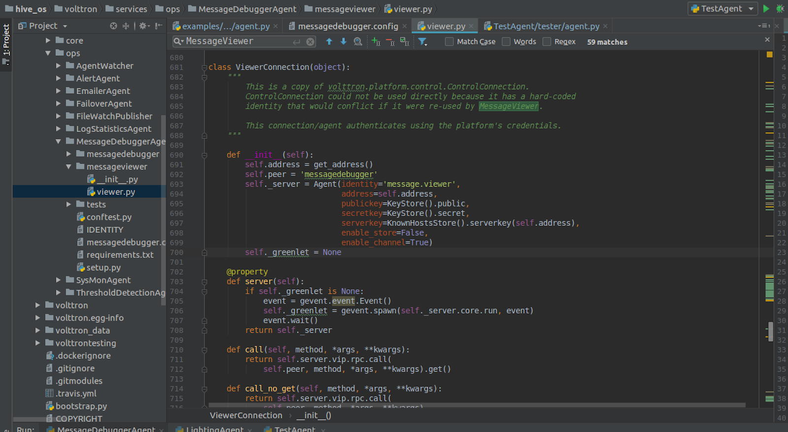
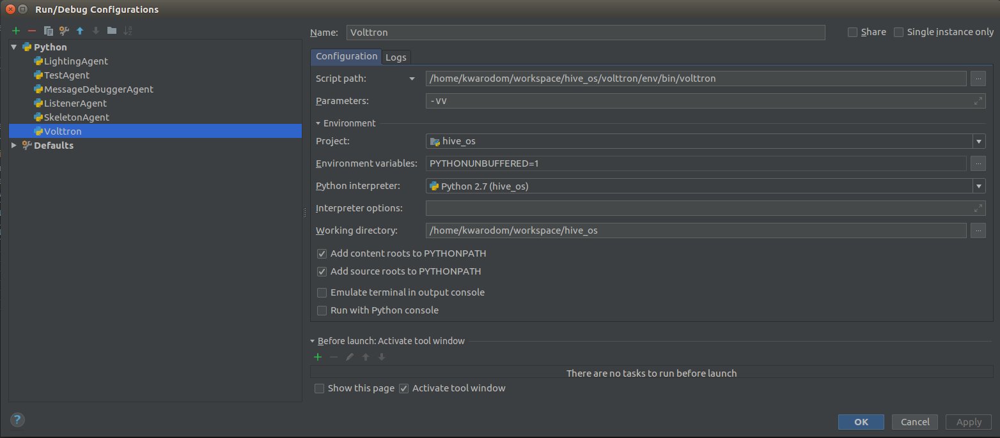
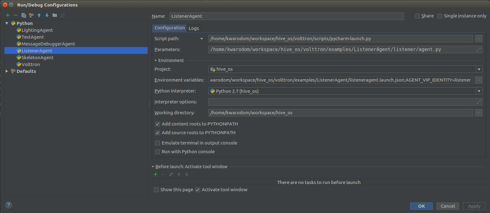

.._os-and-multi-agent-system:

Os-and-multi-agent-system

Layer 2: OS and Multi-Agent Systems
==================================
What is Volttron
----------------
-a secure message bus allowing agents to subscribe to data sources and publish results and messages.
-secure connectivity between multiple instances.
-BACnet, ModBus and other device/system protocol connectivity through our driver framework for collecting data from and sending control actions to buildings and devices.
-automatic data capture and retrieval through our historian framework.
-platform based agent lifecycle management.
-a web based management tool for managing several instances from a central instance.
-the ability to easily extend the functionality of existing agents or create new ones for your specific purposes

2.1 Volttron 5.x Installation
------------------------------------
1. Install with the following command
.. code-block:: python

$

2. Clone Volttron repo
.. code-block:: python

$

3. Bootstrap
.. code-block:: python

$

4. Activate
.. code-block:: python

$

5. Testing : Volttron uses py.test as a framework for executing tests

.. code-block:: python

// to install py.test
$ python bootstrap.py --testing
// to run all the tests in Volttron repo execute the following in the root directory
$ ./ci-integration/run-tests.sh

6. Execution

.. code-block:: python

// to start a default instance of volttron from an activated command prompt
$ volttron -vv
// or to start volttron with logging to a file
$ volttron -vv -l volttron.log&

2.2 Volttron 5.x Building Volttron
-----------------------------------

2.3 Volttron 5.x Developing Volttron
-----------------------------------

# Activate the terminal
source env/bin/activate # Package the agent
volttron-pkg package examples/ListenerAgent

# Set the agent's configuration file
volttron-pkg configure ~/.volttron/packaged/listeneragent-3.2-py2-none-any.whl ˓→examples/ListenerAgent/config

# Install the agent (volttron must be running):
volttron-ctl install ~/.volttron/packaged/listeneragent-3.2-py2-none-any.whl

# Start the agent:
volttron-ctl start --name listeneragent-3.2 # Verify the agent has started
volttron-ctl status

# Note the uuid
# Check that Listener is publishing heartbeat message: cat volttron.log
# Stop the agent

volttron-ctl stop --name listeneragent-3.2

# -- or --
volttron-ctl stop <uuid>

2.4 Run Volttron 5.0 Agent on PyCharm
--------------------------------------
.. image:: ../img/layer2/agent.png
   :width: 100%
Issue 1: if you cannot run Agent in Pycharm, run ‘volttron-ctl auth add’ -> make sure credentials []: /.*/

2.5 Monitor message bus status
-----------------------------------
===========================================
# Activate the terminal
source envin/activate # Package the agent
volttron-pkg package services/ops/MessageDebuggerAgent
# Set the agent's configuration file
volttron-pkg configure ~/.volttron/packaged/messagedebuggeragent-1.0-py2-none-any.whl /home/kwarodom/workspace/hive_os/volttron/services/ops/MessageDebuggerAgent/messagedebugger.config
# Install the agent (volttron must be running):
volttron-ctl install ~/.volttron/packaged/messagedebuggeragent-1.0-py2-none-any.whl
# Start the agent:
volttron-ctl start --name messagedebuggeragent-1.0 # Verify the agent has started
volttron-ctl status
# Note the uuid
# Check that Listener is publishing heartbeat message: cat volttron.log
# Stop the agent
volttron-ctl stop --name messagedebuggeragent-1.0
# -- or --
volttron-ctl stop <uuid>

.. image:: ../img/layer2/massageviwer.png
   :width: 100%

.. image:: ../img/layer2/volttron.png
   :width: 100%

2.6 How to connect to Volttron 5 message bus through any python script
----------------------------------------------------------------------

(volttron)kwarodom@ubuntu:~/workspace/hive_os/volttron/services/ops/MessageDebuggerAgent/messageviewer$ python viewer.py

   Look at this script to find out how

2.7 Running volttron
------
2.7.1 running volttron with verbose output to std log
.. code-block:: python

$ volttron -vv     <-print all log messages to console in real time, should not be used in production

2.7.2 Running volttron as a background process
.. code-block:: python

$ volttron -vv  -l volttron.log > /dev/null 2>&1&

2.7.3 Running volttron as a background process and keep size of the log under control for more longer term deployments use the rotating log configuration file
.. code-block:: python

$ volttron -vv --log-config examples/rotatinglog.py > /dev/null 2>&1&
# this will start rotating the log file at midnight and limit the total log data to seven days worth

2.8 Setting up VOLTTRON as a System Service
--------------------------------------------
Use scripts/admin/volttron.service for systemd as a starting point for setting up VOLTTRON as a service

2.9 Platform Hardening for VOLTTRON
----------------------------------
VOLTTRON is built on top of Linux and underlying Linux platform also needs to be secured in order to declare the resulting control system as “secure”

2.9.1 Linux System Hardening

2.9.2 System Monitoring

2.9.3 Security Testing

2.10 Platform External Access Configuration
------------------------------------------
2.10.1 How to authenticate an agent to communicate with VOLTTRON platform

An administrator can allow an agent to communicate with VOLTTRON platform by creating an authentication record for that agent. An authentication record is created by using volttron-ctl auth add command and entering values to asked arguments.

$ volttron-ctl auth add
   domain []:
   address []:
   user_id []:
   capabilities (delimit multiple entries with comma) []:
   roles (delimit multiple entries with comma) []:
   groups (delimit multiple entries with comma) []:
   mechanism [CURVE]:
   credentials []:
   comments []:
   enabled [True]:

The listed fields can also be specified on the command line:

volttron-ctl auth add --user_id bob --credentials ABCD...

The simplest way of creating an authentication record is by entering the user_id and credential values. User_id is a arbitrary string for VOLTTRON to identify the agent. Credential is the encoded public key string for the agent. Create a public/private key pair for the agent and enter encoded public key for credential parameter.

volttron-ctl auth add
domain []:
address []:
user_id []: my-test-agent
capabilities (delimit multiple entries with comma) []:
roles (delimit multiple entries with comma) []:
groups (delimit multiple entries with comma) []:
mechanism [CURVE]:
credentials []: encoded-public-key-for-my-test-agent
comments []:
enabled [True]:

2.11 Deployment Walkthrough
-------------------------------
This page is meant as an overview of setting up a VOLTTRON deployment which consists of one or more platforms collecting data and being managed by another platform running the VOLTTRON Central agent.

On all machines in the deployment,

[1] setup the platform

$ sudo apt-get install build-essential python-dev openssl libssl-dev libevent-dev git
# clone volttron repo
$ python bootstrap.py

[2] setup encryption,
[3] authentication, and authorization.
[4] build the basic agents for the deployment
[5]  All platforms will need a PlatformAgent and a Historian.
** Using scripts will help simplify this project.

2.12 Forward Historian Deployment
---------------------------------
VOLTTRON Instance 1 forwards data to VOLTTRON instance 2

2.13 Multi-Platform Connection Walkthrough
-----------------------------------------

2.14 Simple Web Agent Walkthrough
---------------------------------
A simple web enabled agent that will hook up with a volttron message ubs and allow interaction between it via http.

This example agent shows a simple file serving agent, a json-rpc based call, and a websocket based connection mechanism

2.14.1 Starting VOLTTRON Platform

Run volttron platform

volttron -vv -l volttron.log --bind-web-address http://127.0.0.1:8080 &

Now we are ready to run a web app

python scripts/install-agent.py \
   --agent-source examples/SimpleWebAgent \
   --tag simpleWebAgent \
   --vip-identity webagent \
   --force \
   --start

2.15 Device Configuration via Volttron Central
-----------------------------------------------

2.16 Running Agent on PyCharm
-----------------------------

2.16.1 run Volttron Platform

2.16.2 run an Agent

2.17 Scalability Experiments
----------------------------
Scalability setup

2.17.1 Core Platform

2.17.2 Socket types

2.17.3 Subsystems

2.17.4 Core Services

2.17.5 Tweaking Tests

2.17.6 Hardware Profiling

2.17.7 Scenarios

2.17.8 Impact on Platform

2.17.9 Improvement Based on Results

2.17.10 Scalability Planning

2.7.11 Test Framework
Laucher script:

The script will be configurable as to the number and type of devices to launch
Configurable as to the hosts to launch virtual devices on
….
2.7.12 Performance Metric Agent

2.18 Build, Configure, Install Agent to Volttron Platform
----------------------------------------------------------

2.19 CSV Historian
-----------------
CSV Historian Agent is an example historian agent that writes
