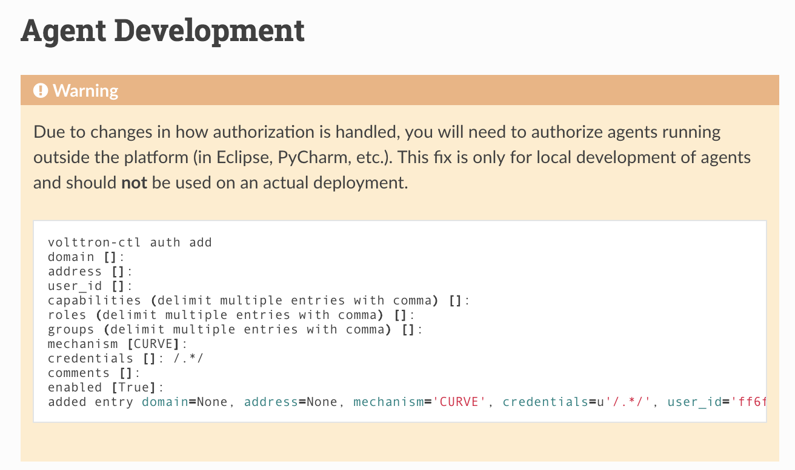
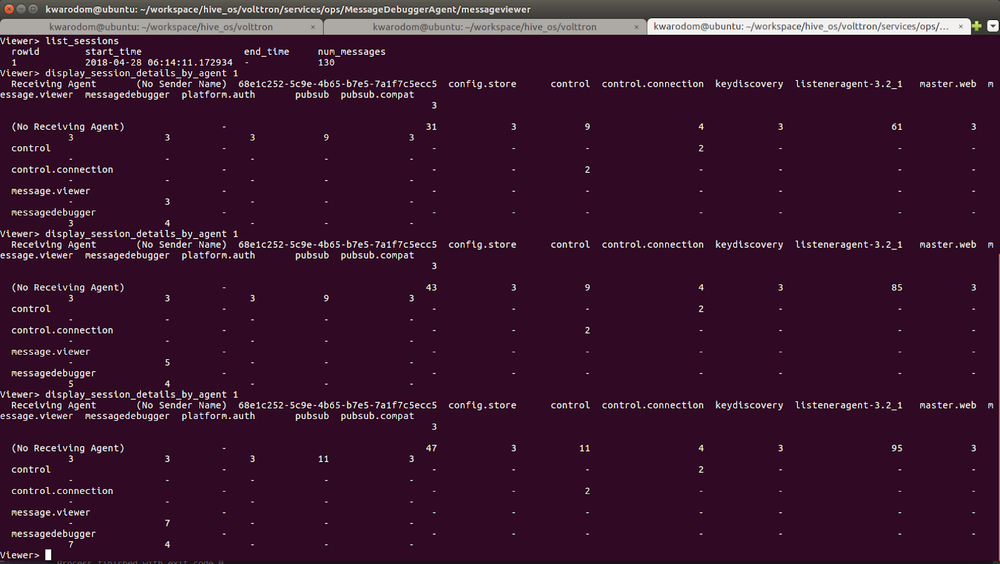
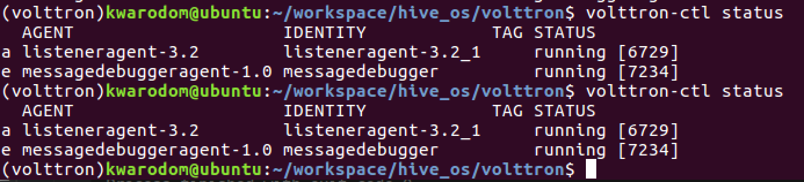

.._os-and-multi-agent-system:

Os-and-multi-agent-system

Layer 2: OS and Multi-Agent Systems
==================================
What is Volttron
-------
-a secure message bus allowing agents to subscribe to data sources and publish results and messages.
-secure connectivity between multiple instances.
-BACnet, ModBus and other device/system protocol connectivity through our driver framework for collecting data from and sending control actions to buildings and devices.
-automatic data capture and retrieval through our historian framework.
-platform based agent lifecycle management.
-a web based management tool for managing several instances from a central instance.
-the ability to easily extend the functionality of existing agents or create new ones for your specific purposes

2.1 Volttron 5.x Installation
------
1. Install with the following command
.. code-block:: python

$

2. Clone Volttron repo
.. code-block:: python

$

3. Bootstrap
.. code-block:: python

$

4. Activate
.. code-block:: python

$

5. Testing : Volttron uses py.test as a framework for executing tests

.. code-block:: python

// to install py.test
$ python bootstrap.py --testing
// to run all the tests in Volttron repo execute the following in the root directory
$ ./ci-integration/run-tests.sh

6. Execution

.. code-block:: python

// to start a default instance of volttron from an activated command prompt
$ volttron -vv
// or to start volttron with logging to a file
$ volttron -vv -l volttron.log&

2.2 Volttron 5.x Building Volttron
-------

2.3 Volttron 5.x Developing Volttron
---------

# Activate the terminal
source env/bin/activate # Package the agent
volttron-pkg package examples/ListenerAgent

# Set the agent's configuration file
volttron-pkg configure ~/.volttron/packaged/listeneragent-3.2-py2-none-any.whl ˓→examples/ListenerAgent/config

# Install the agent (volttron must be running):
volttron-ctl install ~/.volttron/packaged/listeneragent-3.2-py2-none-any.whl

# Start the agent:
volttron-ctl start --name listeneragent-3.2 # Verify the agent has started
volttron-ctl status

# Note the uuid
# Check that Listener is publishing heartbeat message: cat volttron.log
# Stop the agent

volttron-ctl stop --name listeneragent-3.2

# -- or --
volttron-ctl stop <uuid>

2.4 Run Volttron 5.0 Agent on PyCharm
-------

Issue 1: if you cannot run Agent in Pycharm, run ‘volttron-ctl auth add’ -> make sure credentials []: /.*/

2.5 Monitor message bus status
------
===========================================
# Activate the terminal
source envin/activate # Package the agent
volttron-pkg package services/ops/MessageDebuggerAgent
# Set the agent's configuration file
volttron-pkg configure ~/.volttron/packaged/messagedebuggeragent-1.0-py2-none-any.whl /home/kwarodom/workspace/hive_os/volttron/services/ops/MessageDebuggerAgent/messagedebugger.config
# Install the agent (volttron must be running):
volttron-ctl install ~/.volttron/packaged/messagedebuggeragent-1.0-py2-none-any.whl
# Start the agent:
volttron-ctl start --name messagedebuggeragent-1.0 # Verify the agent has started
volttron-ctl status
# Note the uuid
# Check that Listener is publishing heartbeat message: cat volttron.log
# Stop the agent
volttron-ctl stop --name messagedebuggeragent-1.0
# -- or --
volttron-ctl stop <uuid>

