.. _index:

Create Alexa Skill By AWS Lambda (Part 1)
=========================================

สร้าง Alexa Skill ด้วย AWS Lambda อย่างง่าย (ตอนที่ 1)
------------------------------------------------

เรามารู้จัก Amazon Alexa ซึ่งเป็น Voice Control System หรือระบบซอฟแวร์ควบคุมด้วยเสียง การใช้งานของมัน ถ้าไม่มีการพัฒนา Alexa skill การสั่งงานจะใช้ร่วมกับ Hardware ที่ Amazonรองรับเท่านั้น
**แต่ว่าหากเราต้องการนำเอา Alexa มาสั่งการอุปกรณ์ที่เราสร้างขึ้นมาเองจะทำยังไงละ**

**Alexa Skill** จึงตอบโจทย์หากว่าเราต้องการสั่งการอุปกรณ์ใหม่ๆขึ้นมา หรือข้อมูลที่ Alexa ไม่รู้จัก ซึ่งการทำงานของ Skill อย่างง่ายนั้นจะทำตามแผนผังดังรูป คือ เมื่อลำโพงรับเสียงเข้ามาที่ลำโพงแล้วจะส่งไปที่ เพื่อเปลี่ยนเสียงที่ฟังมาเป็นคำสั่ง และส่งคำสั่งดังล่าวไปที่ AWS Lambda เพื่อสั่งให้อุปกรณ์ทำงานตามคำสั่งหรือเพื่อหาข้อมูลที่เราได้โปรแกรมไว้
ดังนั้นในบทความนี้เราจะมาเขียน Alexa Voice Service (AVS) และ AWS Lambda กัน

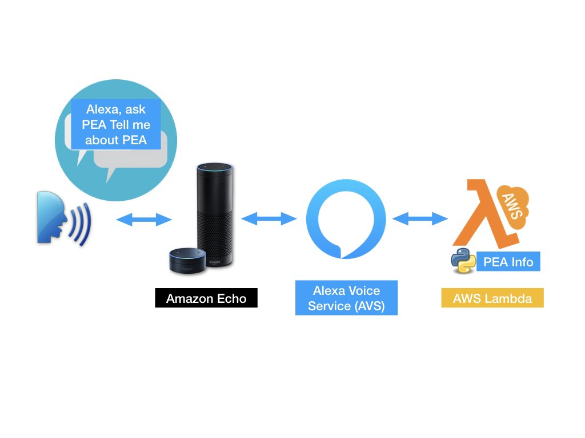

โดย skill แรกที่จะทดลองเขียนนั้นการถามข้อมูลจาก Alexa แล้ว Alexa จะตอบข้อมูลดังกล่าวจากข้อมูลที่เราเขียนลงไปใหน AWS Lambda เช่น

**ถ้าเราถามว่า What is PEA? หรือ Tell me about PEA?**

**Alexa จะตอบว่า** *Provincial Electricity Authority (PEA) is a government enterprise under the Ministry of Interior. PEA is responsible to control and management of PEA branch of ces under the authority cover 74 provinces.*

**ก่อนที่จะเริ่มต้นสร้าง Alexa skill** นั้นสิ่งแรกที่ต้องมีคือ Amazon AWS account โดยสามารถสมัครได้ดัง link ด้านล่าง https://aws.amazon.com/free/

------------

ขั้นที่ 1 Alexa Voice Service (AVS)

เข้าไปที่ https://developer.amazon.com/edw/home.html#/skills

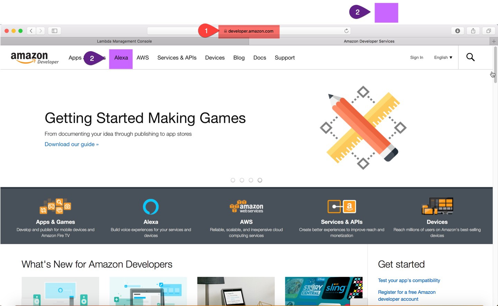

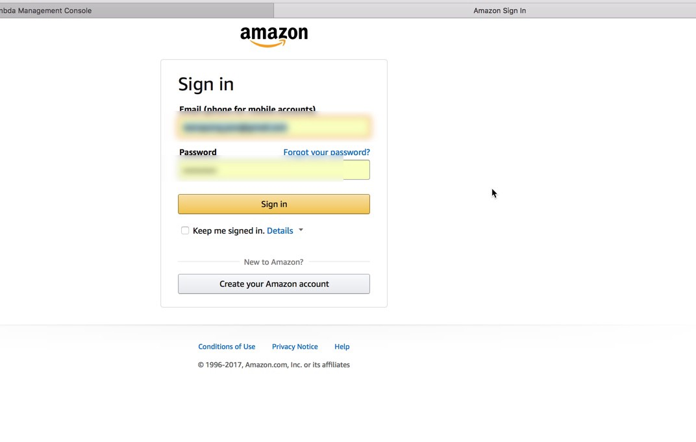

------------

2 เลือก เมนูเพื่อเข้าไปสร้าง Alexa Voice Service (AVS)

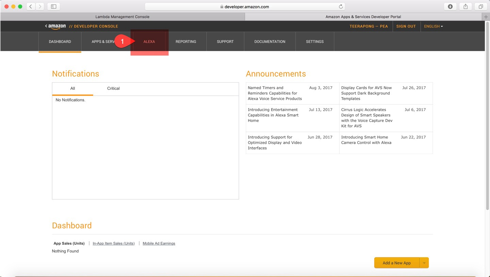

------------

3. สร้าง skill ใหม่

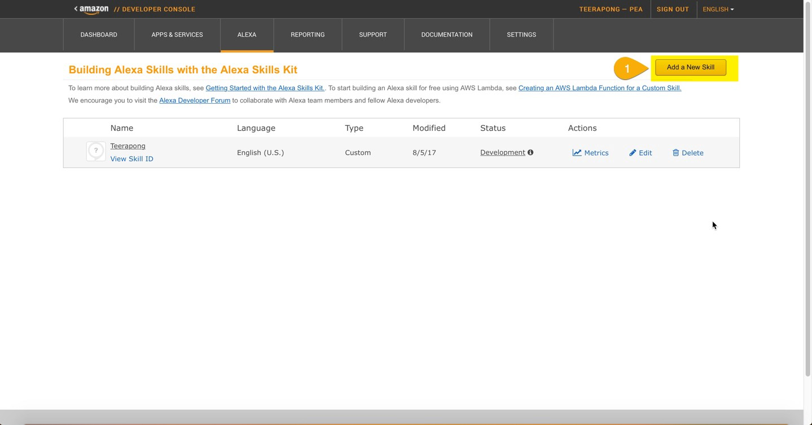

------------

4. set parameter ของ skill

ป้อนชื่อ skill (1) ป้อนชื่อที่ใช้เรียก skill

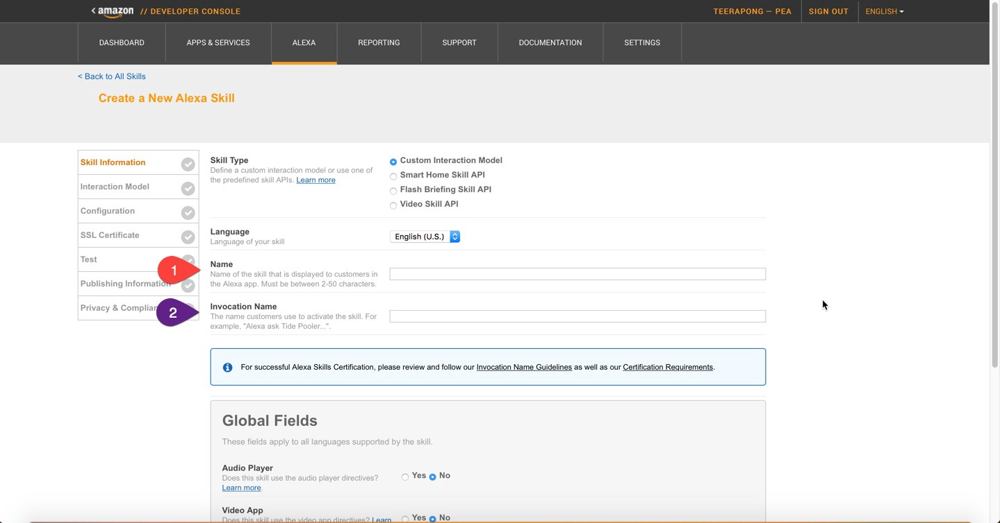

ป้อนค่า Intent_Schema(2) จากไฟล์ Intent_Schema.md ใน

https://github.com/TPponmat/First_Alexa_skill

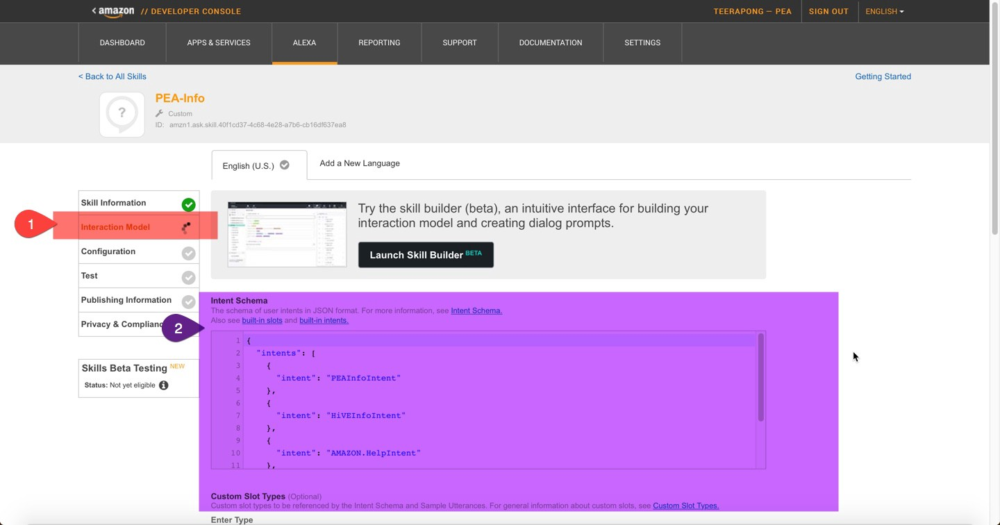

------------

5.ป้อนค่า Sample_Utterances (1) จากไฟล์ Sample_Utterances.md ใน

https://github.com/TPponmat/First_Alexa_skill

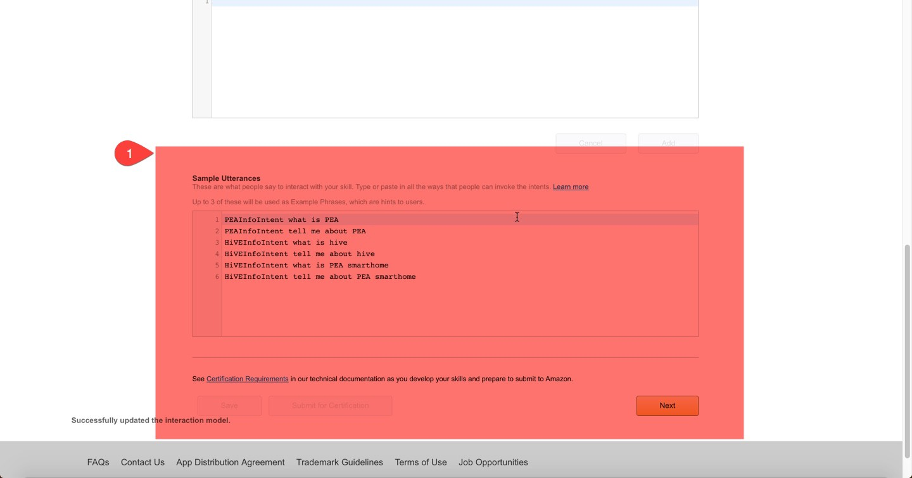

------------

6. Configuration

เลือกเมนูในขั้นตอนที่ (1)(2) ส่วน Link (3) จะนำมาจาก AWS Lambda

โดยขั้นตอนต่อไปจะขอไปสร้าง AWS Lambda ก่อน แล้วค่อยกลับมาทำ Alexa Voice Service (AVS) ต่อ

------------

7. AWS Lambda

ถ้าสมัคร amazon aws แล้ว สามารถลงชื่อใช้งานได้ที่ https://console.aws.amazon.com

เมื่อ login เข้าสู่ระบบแล้วให้พิมพ์ในช่องค้นหาแล้วเลือก Lambda (1)

*เลือก server ของ AWS เป็น N.Virginia

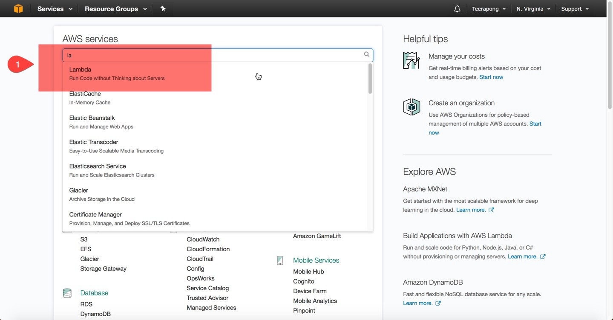

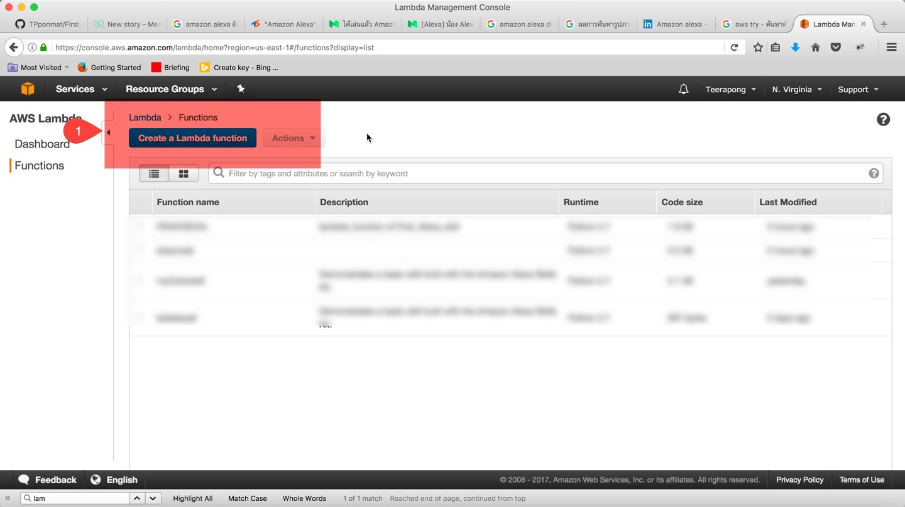

------------

8) เลือก Blank Function (1)

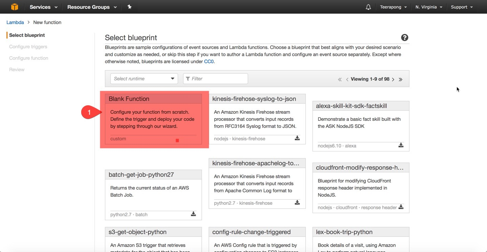

------------

9) เลือก trigger เป็น Alexa skill kit (1)(2)

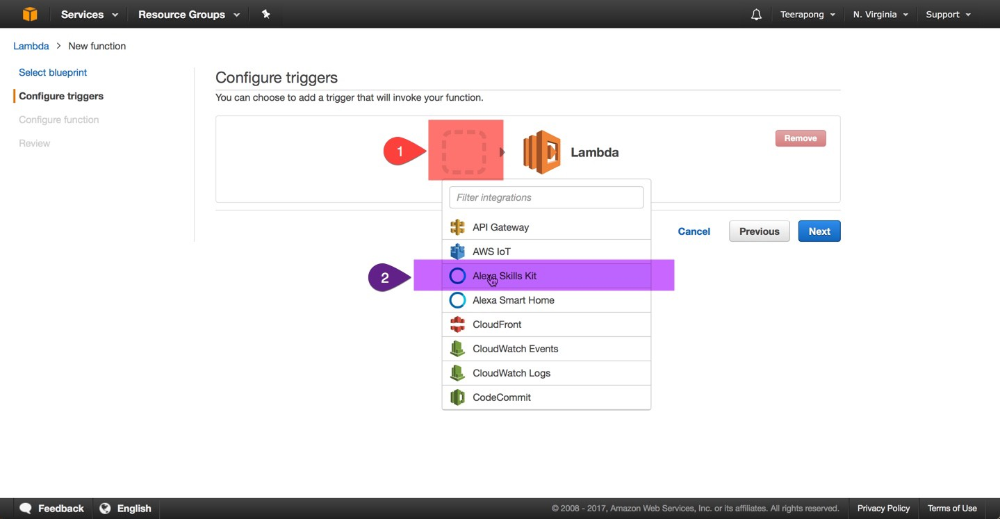

------------

10) ใส่รายละเอียดลงไปตามข้อ (1)(2)(3)(4)(5)

นำ code python ชื่อไฟล์ lambda_function.py

จาก https://github.com/TPponmat/First_Alexa_skill/blob/master/lambda_function.py. ใส่ไปยัง (6)

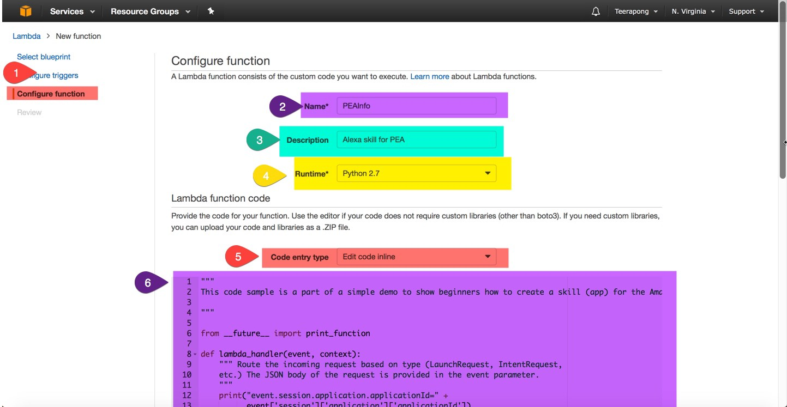

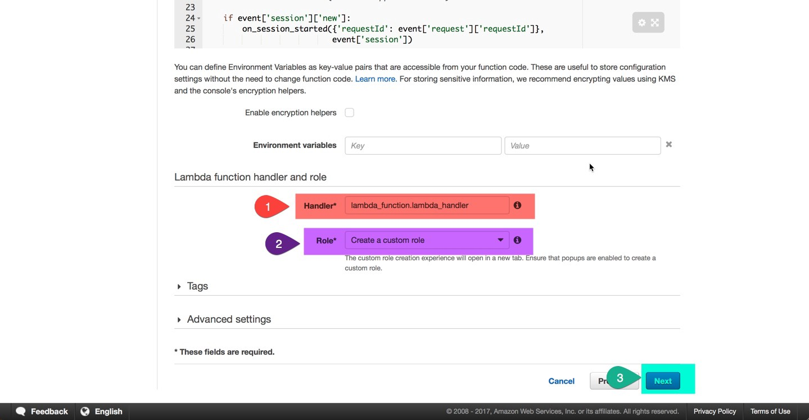

------------

11) หลังจากนั้น click test (1) ถ้าไม่มี error เป็นอันเสร็จขั้นตอนการสร้าง AWS Lambda

จากนั้น copy link ARN (2) ไปใส่ใน Alexa Voice Service (AVS) ในขั้นตอนที่ 6

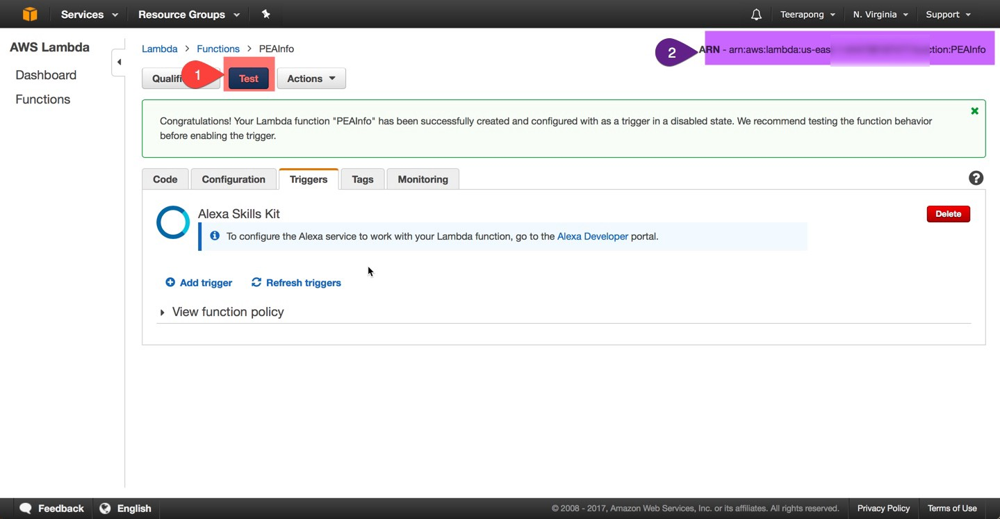

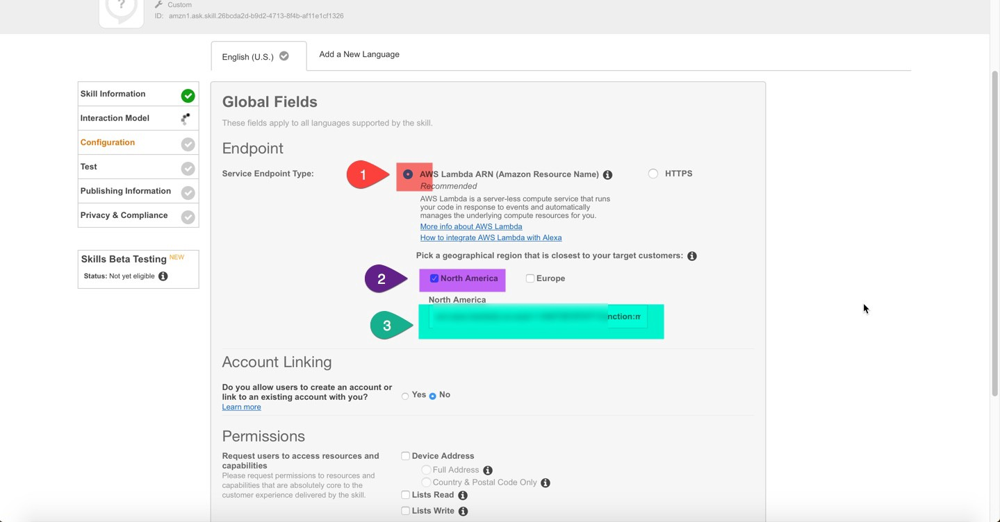

*เป็นอันเสร็จขั้นตอนการสร้าง Alexa Voice Service (AVS) และ AWS Lambda*

------------

12) ทดสอบการทำงานของ skill ที่สร้างขึ้น

**ถ้าเราพิมพ์ว่า Tell me about PEA**

จะมีคำตอบขึ้นมาว่า *Provincial Electricity Authority (PEA) is a government enterprise under the Ministry of Interior. PEA is responsible to control and management of PEA branch of ces under the authority cover 74 provinces.*

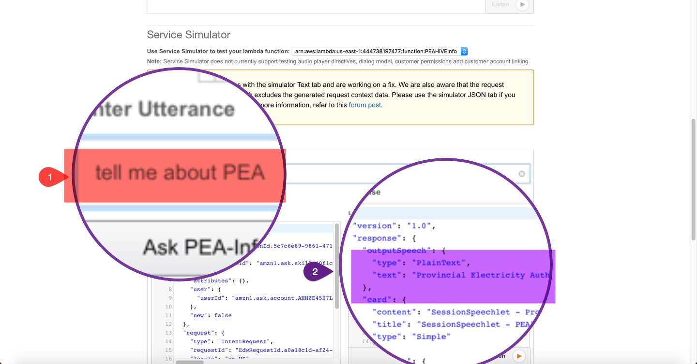

------------

ทดสอบกับ Echosim.io ที่เป็นการจำลองโดยใช้เสียงพูดได้เช่นกัน

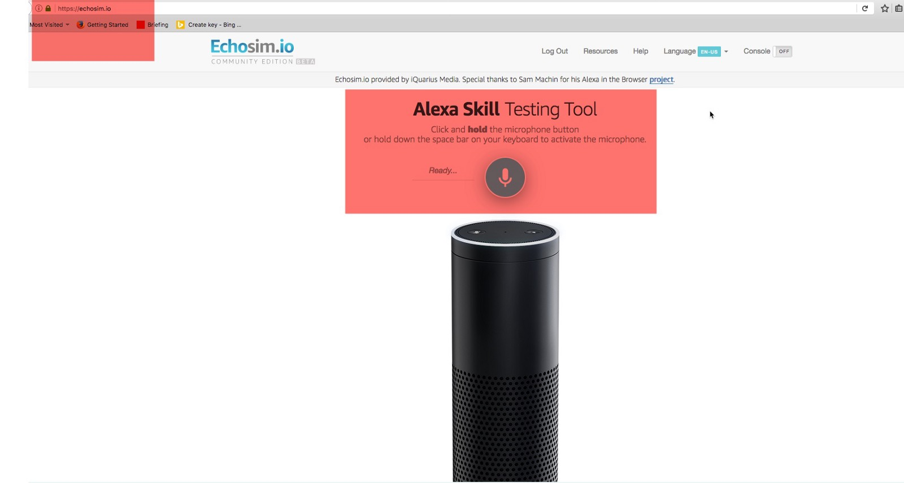
