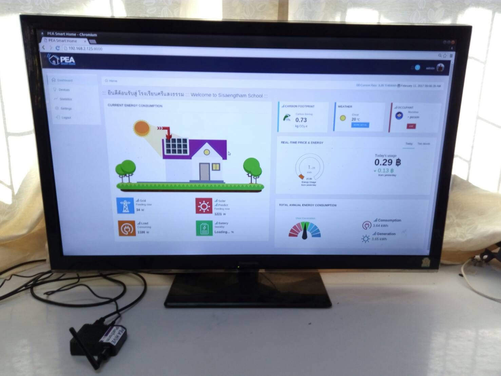
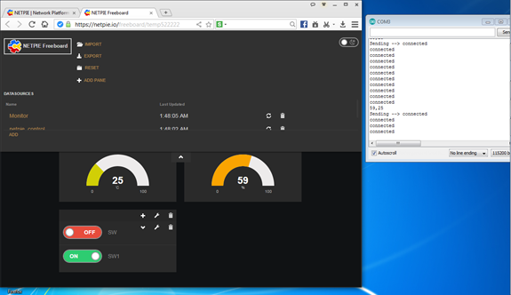

Case Studies
============

Case 1 : โรงเรียนศรีแสงธรรม
-------------------------

.. image:: ../img/case-studies/websitesstschool.png

.. image:: ../img/case-studies/pic1.jpg

*Note: ข้อมูลสรุปการสำรวจและติดตั้ง PEA HiVE Platform ณ โรงเรียนศรีแสงธรรม อ.โขงเจียม จ.อุบลราชธานี วันที่ 8-10 กุมภาพันธ์ 2560*

-----------

**สารบัญ**

1.  แผนการดำเนินงาน

2.	การสำรวจระบบไฟฟ้า

3.	การติดตั้งระบบบริหารจัดการพลังงานอัจฉริยะ  PEA HiVE Platform

4.	การอบรมและสาธิตการใช้ระบบ PEA HiVE Platform และประชุมหารือร่วมกับผู้แทนจาก โรงเรียนศรีแสงธรรม มหาวิทยาลัยอุบลราชธานี และจุฬาลงกรณ์มหาวิทยาลัย

5.	รายชื่อผู้เข้าร่วมการประชุม/อบรมการติดตั้งระบบ PEA HiVE Platform

-----------

1. แผนการดำเนินงาน
---------------------

โรงเรียนศรีแสงธรรม ม.อุบลฯ กวจ และ กฟฉ.2 ให้ความเห็นชอบร่วมกันในหลักการ และแผนการดำเนินงานที่จะปรับปรุงมาตรฐานและความปลอดภัยของระบบไฟฟ้าภายในโรงเรียน ศรีแสงธรรม ตามมาตรฐานของ วศท. พร้อมทั้งการวิจัยและพัฒนาระบบการจัดการพลังงาน ภายในอาคาร (Building Energy Management Systems, BEMS) ที่จะทำให้อาคาร อำนวยการของโรงเรียนเป็น net zero energy building และรองรับ demand response ที่จะเกิดขึ้นในอนาคตได้

**แผนการดำเนินงาน**

ตามแผนการดำเนินงานในข้างต้น โรงเรียนศรีแสงธรรม ม.อุบล กฟฉ.2 และ กวจ. ได้แบ่งระยะการดำเนินการออกเป็น 3 ระยะ ดังนี้

**Phase1**: (4 เดือน สค 59 - พย 59) :

(1) site survey สำรวจระบบไฟฟ้าและเพื่อนำไปเขียนแบบระบบไฟฟ้า (single-line diagram)

(2) requirement collection สอบถามความต้องการและวัตถุประสงค์ของทางโรงเรียนศรีแสงธรรม ม.อุบล และ กฟภ.

(3) standard/safety check ตรวจสอบมาตรฐานการติดตั้งและความปลอดภัยของระบบไฟฟ้า

(4) energy audit สำรวจการใช้พลังงานของอาคารอำนวยการ เพื่อการกำหนดขนาดและออกแบบระบบ solar rooftop PV และการพัฒนาอัลกอริทึมในเฟสถัดไป

(5) renewable energy integration ออกแบบและติดตั้งระบบ solar rooftop PV ณ อาคารอำนวยการของโรงเรียนศรีแสงธรรม

(6) BEMS - only system monitoring ออกแบบและพัฒนาซอฟท์แวร์ระบบบริหารจัดการพลังงานภายในอาคาร โดยจะเน้นในส่วนของการนำค่าจากอุปกรณ์ต่างๆมาแสดงผลให้เห็นไฟฟ้าที่ผลิตได้จากระบบ solar rooftop PV และการใช้พลังงานภายในอาคารอำนวยการของโรงเรียนศรีแสงธรรม

(7) public relation ประชาสัมพันธ์ในเรื่องของมาตรฐานและความปลอดภัย ระบบไฟฟ้าภายอาคาร และระบบผลิตไฟฟ้าจาก solar rooftop PV รวมไปถึงขั้นตอน การขอขนานระบบผลิตไฟฟ้าเข้ากับระบบของ กฟภ.

-----------

**Phase2**: (4 เดือน ธ.ค 59 - มีค 60) :

(1) algorithm development วิจัยและพัฒนาอัลกอริทึมเพื่อที่จะทำให้อาคารอำนวยการของโรงเรียนศรีแสงธรรมเป็น net zero energy building และมีความสามารถในการรองรับ demand response ที่จะเกิดขึ้นในอนาคตได้

(2) BEMS development cont. - full functions including device control พัฒนาซอฟท์แวร์ต่อยอดจากเฟสที่ 1 เน้นในเรื่องของการวัดผลและควบคุมอุปกรณ์ต่างๆ ตามอัลกอริทึมที่ได้พัฒนาขึ้น ทำการทดลองและทดสอบระบบกับอุปกรณ์ภายในอาคารอำนวยการของโรงเรียนศรีแสงธรรม

-----------

**Phase3**: (4 เดือน เม.ย. 60 - ก.ค. 60) :

(1) data analytics ศึกษาและวิเคราะห์ข้อมูลที่ได้จากการเก็บผลการทดลองในเฟสที่ 2 เพื่อทำการวัดผล ปรับปรุงและพัฒนาระบบ BEMS และอัลกอริทึมต่อไป

(2) public relations ประชาสัมพันธ์ในเรื่องของระบบการจัดการพลังงานภายในอาคาร (BEMS)

(3) publication เผยแพร่งานวิจัยและพัฒนาระบบในวารสาร ทางวิชาการทั้งในและต่างประเทศ

(4) training หลักสูตรอบรมให้ความรู้แก่ประชาชนทั่วไป และผู้ที่สนใจเกี่ยวกับ มาตรฐานและความปลอดภัยในการติดตั้งระบบ solar rooftop PV รวมไปถึงระบบการจัดการ พลังงานภายในอาคาร (BEMS)

-----------

**ตารางสรุปแผนการดำเนินงานในขั้นตอนต่างๆ**

+-------------------------------------------+--------------+-----------------------+
|                                           |   Year 2559  |      Year 2560        |
|                                           +--+--+--+--+--+--+--+--+--+--+--+--+--+
|                                           | 8| 9|10|11|12| 1| 2| 3| 4| 5| 6| 7| 8|
+===========================================+==+==+==+==+==+==+==+==+==+==+==+==+==+
|1. Site survey                             | /| /|  |  |  |  |  |  |  |  |  |  |  |
+-------------------------------------------+--+--+--+--+--+--+--+--+--+--+--+--+--+
|2. Requirement collection                  | /|  |  |  |  |  |  |  |  |  |  |  |  |
+-------------------------------------------+--+--+--+--+--+--+--+--+--+--+--+--+--+
|3. Standard/safety check                   | /| /| /|  |  |  |  |  |  |  |  |  |  |
+-------------------------------------------+--+--+--+--+--+--+--+--+--+--+--+--+--+
|4. energy audit                            | /|  |  |  |  |  |  |  |  |  |  |  |  |
+-------------------------------------------+--+--+--+--+--+--+--+--+--+--+--+--+--+
|5. renewable energy integration            | /|  |  |  |  |  |  |  |  |  |  |  |  |
+-------------------------------------------+--+--+--+--+--+--+--+--+--+--+--+--+--+
|6. algorithm development                   |  |  |  |  |  | /| /| /| /| /| /| /| /|
+-------------------------------------------+--+--+--+--+--+--+--+--+--+--+--+--+--+
|7. BEMS - only system monitoring           |  | /| /| /| /|  |  |  |  |  |  |  |  |
+-------------------------------------------+--+--+--+--+--+--+--+--+--+--+--+--+--+
|8. BEMS development cont.                  |  |  |  |  |  | /| /| /| /|  |  |  |  |
|   -full functions including device control|  |  |  |  |  |  |  |  |  |  |  |  |  |
+-------------------------------------------+--+--+--+--+--+--+--+--+--+--+--+--+--+
|9. Data analytics                          |  |  |  |  |  |  |  |  | /| /| /| /| /|
+-------------------------------------------+--+--+--+--+--+--+--+--+--+--+--+--+--+
|10.Public relation/publication             |  |  | /| /|  |  |  |  |  |  |  |  |  |
+-------------------------------------------+--+--+--+--+--+--+--+--+--+--+--+--+--+

-----------

**หน้าที่ของแต่ละฝ่าย**

1.โรงเรียน

- ดำเนินการปรับปรุงระบบไฟฟ้าภายในอาคารให้ได้มาตรฐาน วสท. โดยหารือร่วมกับ กฟฉ.2 และ กวจ.
- ดำเนินการติดตั้งระบบผลิตพลังงานไฟฟ้าจากพลังงานแสงอาทิตย์และแบตเตอรี่เพิ่มเติม โดยกำหนดขนาดติดตั้งจากการออกแบบหลังจากกระบวนการ Energy Audit แล้ว
- จัดทำสื่อการเรียนรู้ด้านพลังงาน
- จัดทำบอร์ดนิทัศการด้านการประชาสัมพันธ์ขั้นตอนการขั้นตอนการขอขนาดไฟกับระบบของกฟภ. โดย กฟฉ.ให้ข้อมูลดังกล่าว
- เข้าร่วมให้ความเห็นถึงแนวทางการพัฒนาซอฟท์แวร์การบริหารจัดการพลังงานภายใน อาคาร (BEMS) และการพัฒนาอัลกอริทึม

-----------

2. กฟฉ.2

- ร่วมกับ ม. อุบล สำรวจระบบไฟฟ้าภายในโรงเรียน และเขียนแบบทางไฟฟ้าภายในโรงเรียน โดยเริ่มจากการสำรวจอาคารอำนวยการเป็นอันดับแรก
- ตรวจสอบแบบการปรับปรุงและติดตั้งระบบไฟฟ้าใหม่ ถึงมาตรฐานการติดตั้งก่อนที่โรงเรียนจะเริ่มดำเนินการปรับปรุงระบบ
- ทำ Energy Audit เพื่อนำมาเป็นข้อมูลในการเลือกขนาดพลังงานทดแทนและแบตเตอรีที่จะนำมาติดตั้งเพิ่ม
- จัดตั้งทีมงานเพิ่มเติมที่จะเข้าร่วมในการพัฒนาซอฟท์แวร์การบริหารจัดการพลังงานภายในอาคาร (BEMS) และการพัฒนาอัลกอริทึม ร่วมกับโรงเรียน กวจ และม.อุบล

-----------

3. ม.อุบล

- ทำการสำรวจอาคารและสิ่งปลูกสร้างต่างๆ พร้อมทั้งระบบไฟฟ้าภายในอาคาร (เขียน single-line diagram ของระบบไฟฟ้าของอาคารต่างๆในโรงเรียน)
- ทำแผนและร่วมดำเนินการติดตั้งอุปกรณ์ที่มีความสามารถในการวัดค่าและควบคุม (monitoring and control) สำหรับระบบ solar rooftop PV (แผง solar cell, charge contoller, inverter, และ battery), ระบบไฟฟ้าเข้าอาคารที่มาจาก กฟภ., ระบบไฟฟ้าด้านโหลด (ระบบปรับอากาศ, ระบบแสงสว่าง, ระบบเต้าเสียบ), และเซนเซอร์ต่างๆ (temperature sensor, humidity sensor, illuminance sensor ฯลฯ)
- ทำ co-research ร่วมกับ กวจ. ในการพัฒนาซอฟท์แวร์การบริหารจัดการพลังงานภายในอาคาร (BEMS) และการพัฒนาอัลกอริทึม ที่จะทำให้อาคารอำนวยการของโรงเรียนแสงศรีธรรมเป็น zero energy building และรองรับ demand response ที่จะเกิดขึ้นในอนาคต
- ร่วมกับ กฟฉ. 2. ให้คำปรึกษาเรื่องมาตรฐานและความปลอดภัยของระบบไฟฟ้าภายในอาคาร และระบบ solar rooftop PV กับโรงเรียนศรีแสงธรรม
- เสนอแผนงานวิจัย  co-research ให้กับทางวัดและกฟภ.

-----------

4. กวจ

- ประสานงานกับ กฟฉ. 2 ในเรื่องของการตรวจสอบมาตรฐานและความปลอดภัยให้เป็นไปตามมาตรฐานของ วศท.
- วิเคราะห์ข้อมูลจากการทำ energy audit เพื่อศึกษาการใช้พลังงานของอาคาร รวมไปถึงพลังงานที่ผลิตได้จากระบบ solar rooftop PV
- ให้คำแนะนำและช่วยเหลือด้านเทคนิค ในส่วนของอุปกรณ์ กับทาง ม.อุบล เพื่อการทำต้นแบบของ BEMS
- ทำงานวิจัยแบบ co-research ร่วมกับ ม.อุบลฯ. ในการพัฒนาซอฟท์แวร์เพื่อการบริหารจัดการพลังงานภายในอาคาร เพื่อการทำให้อาคารอำนวยการของ รร.ศรีแสงธรรม เป็น net zero energy building และมีความสามารถในการรองรับ demand response ที่จะเกิดขึ้นในอนาคต
- พัฒนาอัลกอริทึมสำหรับ net zero energy building และ demand response ร่วมกับ ม.อุบลฯ
- อบรมการพัฒนาซอฟท์แวร์สำหรับระบบ BEMS พร้อมทั้งการพัฒนาและใช้งาน NETPIE เพื่อการพัฒนาบุคลากรของ กวจ. และ ม.อุบลฯ

-----------

**ความคืบหน้าด้านการดำเนินงาน Phase 1   (ธ.ค. 59 - มี.ค. 60)**
       1. Site survey ได้ดำเนินการสำรวจระบบไฟฟ้าในอาคารอำนวยการเพื่อนำไปเขียนแบบระบบไฟฟ้า (single-line diagram) ต่อไป
       2. Energy audit ได้ทำการติดตั้งเครื่องวัดเพื่อเก็บข้อมูลการใช้โหลดและกำลังการผลิตของระบบ solar rooftop PV ภายในอาคารอำนวยการของโรงเรียนศรีแสงธรรม เป็นที่เรียบร้อยแล้ว
       3. ประชุมหารือแลกเปลี่ยนความเห็นและความร่วมมือระหว่างโรงเรียนศรีแสงธรรม ม.อุบล และกฟภ. โดยทั้ง 3 ฝ่ายให้ความเห็นชอบกับแผนการดำเนินการที่ทาง กวจ. ได้นำเสนอ

*Link สำหรับดาวน์โหลด presentation การประชุมหารือความร่วมมือระหว่าง โรงเรียนศรีแสงธรรม ม.อุบล และ กฟภ. วันที่ 27 กรกฏาคม 2559*, Click_.

.. _Click: https://docs.google.com/presentation/d/1vQU_xrzGBD5SUj9aJLBwBJHVsqUky_5NniY3FFIea2E/edit#slide=id.g15f2e76213_0_0

-----------

2. การสำรวจระบบไฟฟ้า
-----------------------

โรงเรียนศรีแสงธรรมตั้งอยู่ในพื้นที่การจ่ายไฟฟ้าของการไฟฟ้าอำเภอโขงเจียม รับไฟผ่านมิเตอร์ 1 เฟส
มีการใช้ไฟฟ้าส่วนใหญ่สำหรับการเรียนการสอนภายในพื้นที่โรงเรียนมีการติดตั้งระบบผลิตกระแสไฟฟ้าจาก พลังงานแสงอาทิตย์และระบบกักเก็บพลังงานแบบแบตเตอรี่ตะกั่วกรดสำหรับจ่ายไฟให้หลอดแสงสว่างกระแสตรงและเครื่องใช้ไฟฟ้าอื่นๆ เช่น ตู้เย็น

*รูปที่ 1 แผนผังโรงเรียนศรีแสงธรรม*

------------

**ระบบจ่ายไฟฟ้าภายในพื้นที่โรงเรียนศรีแสงธรรม สำหรับอาคารหลักๆ สรุปได้ดังนี้**

1)	อาคารอำนวยการ รับไฟฟ้าแบบ Hybrid สามารถรับไฟฟ้าจากระบบของ กฟภ. และจากพลังงานแสงอาทิตย์ที่มีการติดตั้งแบตเตอรี่เพื่อกักเก็บพลังงานใว้ใช้ในเวลากลางคืนอีกด้วย

*รูปที่ 2 แผนผังระบบไฟฟ้าอาคารอำนวยการ*

------------

2)	อาคารเรียน 1  รับไฟฟ้าแบบ Hybrid สามารถรับไฟฟ้าจากระบบของ กฟภ. และจากพลังงานแสงอาทิตย์

*รูปที่ 3 แผนผังระบบไฟฟ้าอาคารเรียน 1*

------------

3)	อาคารเรียน 2 (อาคาร 3 ชั้น) รับไฟฟ้าแบบ Hybrid สามารถรับไฟฟ้าจากระบบของ กฟภ. และจากพลังงานแสงอาทิตย์ที่มีการติดตั้งแบตเตอรี่เพื่อกักเก็บพลังงานใว้ใช้ในเวลากลางคืนอีกด้วย

*รูปที่ 4 แผนผังระบบไฟฟ้าอาคารเรียน 2 (อาคาร 3 ชั้น)*

------------

4)	อาคารห้องพยาบาล รับไฟฟ้าแบบ Hybrid สามารถรับไฟฟ้าจากระบบของ กฟภ. และจากพลังงานแสงอาทิตย์

*รูปที่ 5 แผนผังระบบไฟฟ้าอาคารห้องพยาบาล*

------------

จากการตรวจสอบการติดตั้งระบบผลิตพลังงานไฟฟ้าจากพลังงานแสงอาทิตย์ของโรงเรียนศรีแสงธรรม
แต่ละอาคารพบว่าถูกต้องตามมาตรฐานการติดตั้งทางไฟฟ้าระบบการผลิตไฟฟ้าจากพลังงานแสงอาทิตย์ที่ติดตั้งบนหลังคาของ วสท. ดังรูปที่ 6

*รูปที่ 6 การติดตั้งระบบการผลิตไฟฟ้าจากพลังงานแสงอาทิตย์*

------------

อีกทั้งในโรงเรียนศรีแสงธรรมยังได้มีการจัดอบรมการติดตั้งระบบการผลิตไฟฟ้าจากพลังงานแสงอาทิตย์ โดยผ่านมาแล้วทั้งสิ้น 8 รุ่น  เพื่อให้บุคลทั่วไปที่สนใจเข้าร่วมอบรมเพื่อเป็นความรู้หรือเพื่อใช้ในการประกอบ อาชีพรับเหมาติดตั้งอีกด้วย รวมถึงที่โรงเรียนยังเป็นแหล่งคิดค้นนวัตกรรมที่เกี่ยวข้องกับการประยุกต์ใช้พลังงาน ทดแทน โดยนวัตกรรมที่เกิดขึ้นในโรงเรียน ได้แก่ รถเข็นไฟฟ้าชุดนอนนาเป็นการประยุกต์ใช้โซล่าเซลล์ และตัวแบตเตอรี่ชุดไฟฉายที่ใช้ไฟฟ้าจากพลังงานไฟฟ้าโซล่าเซลล์ และรถสามล้อพลังงานแสงอาทิตย์ ดังรูปที่ 7

*รูปที่ 7 รถสามล้อพลังงานแสงอาทิตย์*

------------

3. ติดตั้งระบบบริหารจัดการพลังงานอัจริยะ (PEA HiVE Platform)
--------------------------------------------------------

**2.1 การติดตั้งระบบบริหารจัดการพลังงานอัจริยะ (PEA HiVE Platform) ในส่วนของอุปกรณ์ที่ติดตั้ง เพิ่มเติมภายในโรงเรียน**

2.1.1) Power Meter (ในการวัดพลังงานไฟฟ้า) ดังรูปที่ 8 อุปกรณ์ชนิดนี้ทำงานโดยวัดค่ากระแสที่อ่าน ได้จาก CT และนำค่ากระแสที่ได้มาคำนวนเป็นค่ากำลังไฟฟ้า โดยการติดตั้ง CT นั้นจะติดตั้ง ทั้งสิ้น 2 จุดโดยติดตั้งที่ Grid และ PV+Battery โดยที่การติดตั้งเพียง 2 จุดนั้นสามารถนำมาคำนวนค่าโหลด ภายในอาคารได้จากสมการ ดังรูปที่ 8 โดยรูปที่ 9 เป็นผังของจุดติดตั้ง Power Meter ภายในอาคารอำนวนการ โดยการติดตั้ง Power Meter แบบนี้นั้นมีข้อเสีย คือไม่สามารถวัดค่าการผลิตพลังงานไฟฟ้ากระแสตรง จากแผงโซลาร์เซลล์ได้โดยตรงโดยค่าที่ อ่านได้เป็นค่ากำลังไฟฟ้าด้าน​ AC output ของ inverter ซึ่งเป็นค่ากำลังไฟฟ้าของแผลโซลาร์ PV และ Battery รวมกัน

*รูปที่ 8 การติดตั้ง Power Meter*

.. image:: ../img/case-studies/setuppowermeter2.jpg
*รูปที่ 9 การติดตั้ง Power Meter*

------------

2.1.2) อุปกรณ์เชื่อมต่อ PV Inverter เพื่ออ่านค่าพารามิเตอร์ที่ได้จาก PV เช่น กำลังไฟฟ้าจากกริด กำลังไฟฟ้าจากโซล่าเซลล์ สถานะแบตเตอรี่และโหมดการทำงานเป็นต้น ซึ่งจำเป็นต้องติดตั้งอุปกรณ์เพิ่มเติม ดังรูปที่ 10 คือ RS232 / RS485 Serial Wireless Servers, Wireless Device Servers ใช้สำหรับแปลงข้อมูล จากจากชุด inverter แล้วส่งสัญญาณออกไปในรูปแบบ Wifi โดยทำการเชื่อมต่ออินเวอร์เตอร์กับเครื่อง wifi module (USR-WIFI232-630) ผ่านสายRS 232 เพื่อส่งข้อมูลค่าต่างๆบนอินเวอร์เตอร์ ไปยังฐานข้อมูลผ่านสัญญาณ อินทอร์เน็ต wifi แต่การติดตั้ง RS232 / RS485 Serial Wireless Servers เพื่ออ่านค่าที่โรงเรียนศรีแสงธรรม ยังไม่สามารถอ่านค่าพารามิเตอร์ที่ออกมาได้ PV Inverter ได้เนื่องจากยังไม่มีคู่มือการใช้งาน Modus ของ Inverter

*รูปที่ 10 การเชื่อมต่อ อินเวอร์เตอร์กับ USR-WIFI232-630*

*รูปที่ 11 โปรแกรม WatchPower ใช้แสดงข้อมูลของอินเวอร์เตอร์*

------------

2.1.3) อุปกรณ์ PEA HiVE Hub version 1 ดังรูปที่ 12 โดยตัว Hub ได้ถูกติดตั้ง Software ในเวอร์ชั่นที่ 1 โดยทำหน้าที่เป็น sever ในการอ่านค่าจาก Smappee smart meter หรือจากข้อมูลภายนอก เช่นข้อมูลสภาพอากาศ เพื่อนำมาคำนวนและแสดงผล

*รูปที่ 12 PEA HiVE Hub version 1*

------------

**2.2 การติดตั้งระบบบริหารจัดการพลังงานอัจริยะ (PEA HiVE Platform) ในส่วนของ software**

โดยได้มีการติดตั้ง PEA HiVE Platform บน web application ดังรูปที่ 13 ซึ่งเป็น Dashboard แสดงข้อมูลต่างๆภายในอาคารได้แก่ แถบแสดงค่าไฟฟ้า และวัน-เวลา สถานะของกำลังไฟฟ้าของบ้าน ณ ปัจจุบัน (Real Time Home Status) สภาพอากาศ ณ ปัจจุบัน ปริมาณการลด Co2 ปริมาณการใช้พลังงานภายในบ้าน และประมาณราคาค่าไฟ ปริมาณพลังงานไฟฟ้ารวมในหนึ่งปี เป็นต้น

.. image:: ../img/case-studies/dashboard1.png

*รูปที่ 13 Dashboard*

------------

4. อบรมและสาธิตการใช้ระบบ PEA HiVE Platform และประชุมหารือร่วมกับผู้แทนจากโรงเรียนศรีแสงธรรม มหาวิทยาลัยอุบลราชธานี จุฬาลงกรณ์มหาวิทยาลัย
----------------------------------------------------------------------------------------------------------------------------

**3.1 อบรมและสาธิตการใช้ระบบ PEA HiVE Platform โดยได้อบรมทั้งสิ้น 2 ส่วนด้วยกันคือ การใช้งานอุปกรณ์ที่เชื่อมต่อกับ PEA Hive และการพัฒนาโปรแกรมด้วยภาษา Python รวมถึงทดลองเขียน appication ใน HiVE Platform**

3.1.1) การใช้งานอุปกรณ์ที่เชื่อมต่อกับ PEA Hive

i ) การอบรมการเชื่อมต่อ inverter ด้วยโปรแกรม WatchPower บนคอมพิวเตอร์
และทำการเชื่อมต่อกับตัวอินเวอร์เตอร์ (Inverter) เพื่อทำการดึงข้อมูลเพื่อแสดงผลบนหน้าจอโปรแกรม
และดึงข้อมูลจาก Power meter ดังรูปที 14

.. image:: ../img/case-studies/watchpower-powermeter.png

*รูปที่ 14 โปรแกรม WatchPower ใช้แสดงข้อมูลของอินเวอร์เตอร์ และ การเชื่อมต่อ Power Meter*

------------

ii ) การทำงานของ netpie ซึ่งเป็นการควบคุมระบบสิ่งต่างๆ ที่เราจะทำการควบคุมโดยการเขียนโปรแกรม

ผ่าน node mcu ซึ่งเป็นอุปกรณ์ที่ใช้ในการเชื่อมต่อ กับตัวโปรแกรมกับ NETPIE  ดังรูปที่ 15

*รูปที่ 15 NETPIE*

โดยตัว NETPIE สามารถควบคุมอุปกรณ์ต่าง เช่น หลอดไฟ พัดลม แอร์ หรือ โหลดอื่นๆที่เราต้องการที่จะควบคุม  โดยการเขียนตัวโปรแกรมเพื่อควบคุมการทำงานของอุปกรณ์ด้วยภาษา ภาษา C ผ่าน node mcu เพื่อให้ node mcu ไปสั่งงานยังที่โหลดและยังสามารถสั่งงานผ่าน internet ไร้สายได้ด้วยการสั่งงาน ผ่าน wifi  และยังแสดงผ่าน monitoring บนหน้าเว็บหรือ สำหรับโปรแกรมที่ใช้ เขียนคือโปรแกรม ADUINO ดังในรูปที่ 16

*รูปที่ 16 ลักษณะของโปรแกรมที่ใช้ในการเขียน*

หลังจากเขียนโปรแกรมลงบนตัวของ node mcu เพื่อทำการควบคุมอุปกรณ์ เช่น ทำการวัดอุณหภูมิ การสั่งงาน RELAY อื่นๆ อีกมากมาย จากนั้นทำการควบคุมด้วยแผงควบคุมของ NETPIE ดังรุปที่ 17

*รูปที่ 17 ลักษณะของโหลดที่ทำการควบคุมและแผงควบคุมของ NETPIE*

------------

3.1.2) การพัฒนาโปรแกรมด้วยภาษา Python รวมถึงทดลองเขียน application ใน HiVE Platform

i) อบรมการพัฒนาโปรแกรมด้วยภาษา Python

*รูปที่ 18  แสดงโปรแกรม Pycharm*

------------

ii) ทดลองเขียน appication ใน HiVE Platform ในหัวข้อ carbon footprint ซึ่งต้องนำข้อมูลนี้ ขึ้นแสดงบน หน้าเว็บ ซึ่ง "คาร์บอนฟุตพริ้นท์" หมายถึง ปริมาณก๊าซเรือนกระจกที่ปล่อยออกมาจากการ

*รูปที่ 19  สูตรการคำนวน carbon footprint*

------------

ผลจาการสร้าง appication ใน HiVE Platform ในหัวข้อ carbon footprint ที่ได้ปริมาณ carbon footprint หรือปริมาณคาร์บอนไดออกไซด์ ที่โรงเรียนสามารถลดได้ ซึ่งสามารถ

แสดงผลในเวปไซด์ ดังแสดงดังรูปที่ 20

*รูปที่ 20 ปริมาณ carbon footprint ที่แสดงบหน้าเวปไซด์*

------------

**3.2 ประชุมหารือร่วมกับผู้แทนจากโรงเรียนศรีแสงธรรม มหาวิทยาลัยอุบลราชธานี จุฬาลงกรณ์มหาวิทยาลัย โดยมีการนำเสนอแผนต่างๆของแต่ละฝ่ายโดยมีรายละเอียดของผลการหารือในแต่ละฝ่ายดังรูปที่ 21 โดยรายละเอียดสรุปได้ดังต่อไปนี้**

1. โรงเรียนศรีแสงธรรม โดยพระครูพระครูวิมลปัญญาคุณได้กล่าวสรุปถึงการใช้พลังงาน ณ อาคารต่างๆในโรงเรียนศรีแสงธรรม รวมถึงกิจกรรมภายในโรงเรียน รวมถึงความคาดหวังของ PEA HiVE Hub ที่ต้องการนำมาใช้ในโรงเรียน
2. ม.จุฬา ได้เล่าถึงโครงการ smart grid ที่คาดว่าจะนำมาติดตั้งในโรงเรียนศรีแสงธรรมโดยจะทำเป็น
ระบบบริหารจัดการพลังงานงานในโรงเรียนฯซึ่งปัจจุบันอยู่ระหว่างเสนอโครงการกับกระทรวงพลังงาน

3. ม.อุบล ได้หารือถึงความร่วมมือกับโรงเรียนศรีแสงธรรมและทาง กฟภ. ในการร่วมพัฒนา HiVE platfrom ใน 2 ส่วนหลักๆ คือ ด้านของอุปกรณ์ที่เชื่อมต่อกับ HiVE ได้ และการเขียนใน ส่วนของ application และทาง ม.อุบลได้ขอความร่วมมือ กฟภ. ในการให้การอบรมการพัฒนาดังกล่าวที่ ม. อุบลในครั้งต่อไป
4. กฟภ. ได้สรุปการติดตั้ง HiVE เวอร์ชั่น 1 และแผนการดำเนินการครั้งต่อไป คือการพัฒนา software ให้ดีขึ้น และเพิ่มส่วนของการเก็บข้อมูลและวิเคราะห์ข้อมูล

*รูปที่ 21 การประชุมหารือร่วมกับผู้แทนจากโรงเรียนศรีแสงธรรม*

------------

5. รายชื่อผู้เข้าร่วมประชุม/อบรมการติดตั้งระบบ PEA HiVE Platform
----------------------------------------------------------

*รูปที่ 22 ผู้เข้าร่วมอบรม/ประชุม ณ โรงเรียนศรีแสงธรรม*

**การไฟฟ้าส่วนภูมิภาค**

1.   ดร.วโรดม            คำแผ่นชัย

2.   นายธีรพงษ์            พลมาตย์

3.   นางสาวนพรัตน์         อภิชาตสิริธรรม

**โรงเรียนศรีแสงธรรม**

4.   พระครูวิมลปัญญาคุณ

**มหาวิทยาลัยอุบลราชธานี**

5.   ดร.ประชา             คำภักดี

6.   ผศ.ดร. วรการ         วงศ์สายเชื้อ

7.   ดร.อธิพงศ์             สุริยา

8.   ดร.เกรียงศักดิ์         ตรีประพิณ

9.   นายผดุง               กิจแสวง

10. นายวิชชุกร             อุดมรัตน์

**จุฬาลงกรณ์มหาวิทยาลัย**

11. นายศรุต               ศรีสันติสุ

------------

6. ความคืบหน้าของโรงเรียนศรีแสงธรรม
------------------------------------

