.. _index:

How to sync firebase realtime data base to website
==================================================

วิธีการเชื่อมข้อมูล Firebase แบบเรียลไทม์ขึ้น website
-------------------------------------------

**step 1 จัดเตรียม website ด้วย**

1. http://keenthemes.com/preview/metronic/theme/admin_1/dashboard_2.html

2. https://mobirise.com

------------

โดยสามารถ clone project ได้ที่

https://github.com/TPponmat/firebasetoweb.git

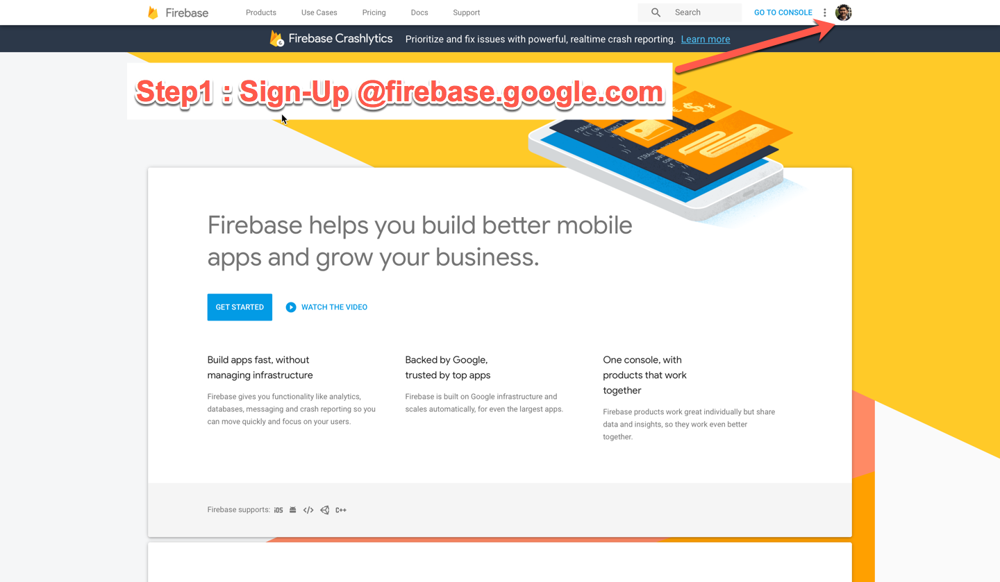

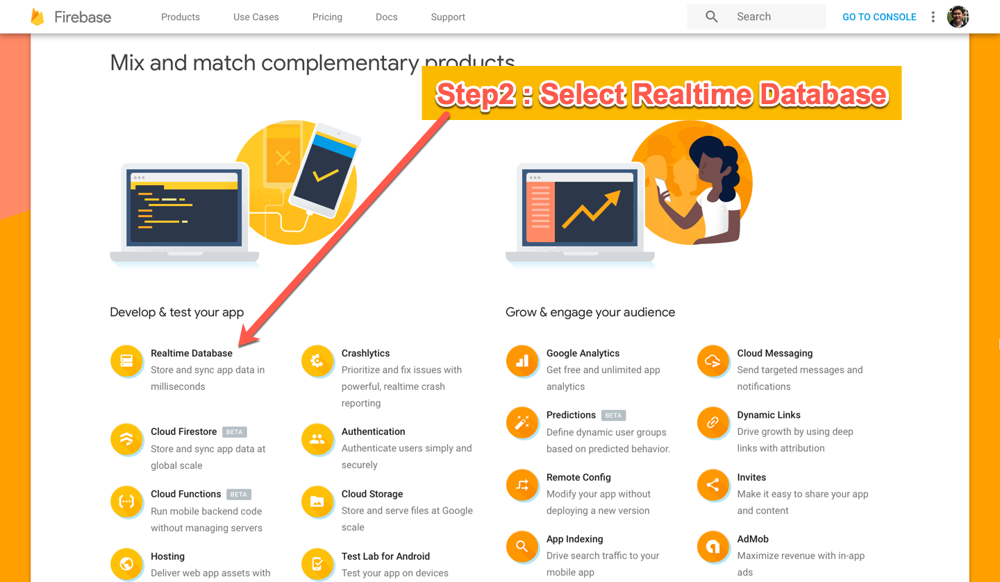

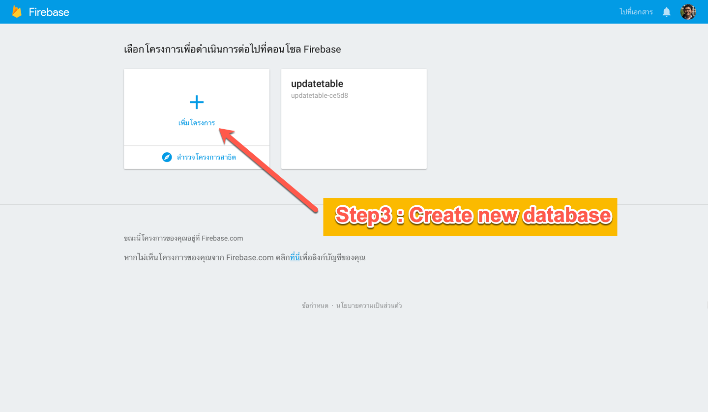

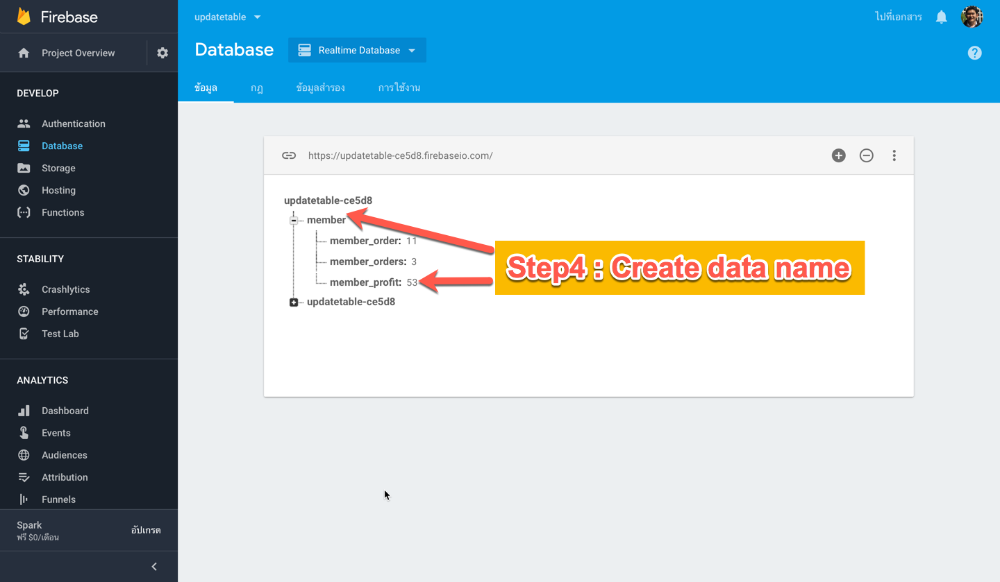

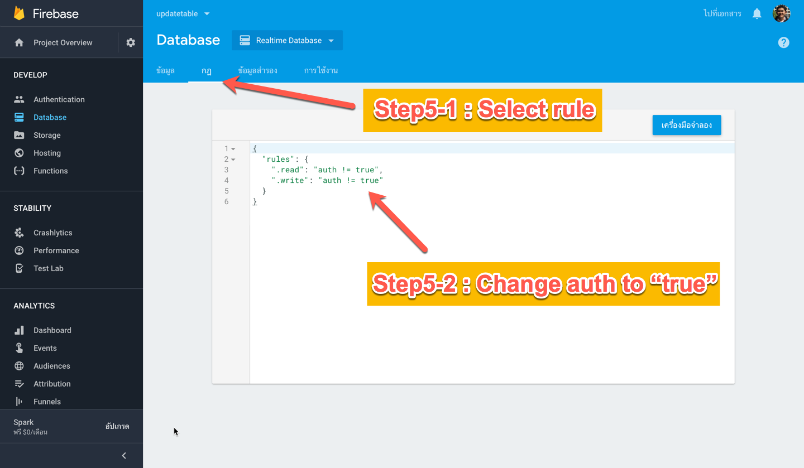

.. image:: ../img/firebase-to-website/step6.png

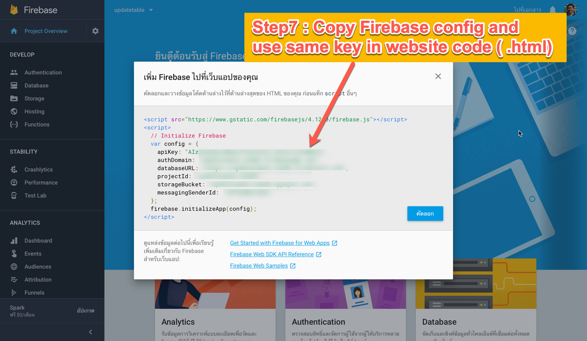

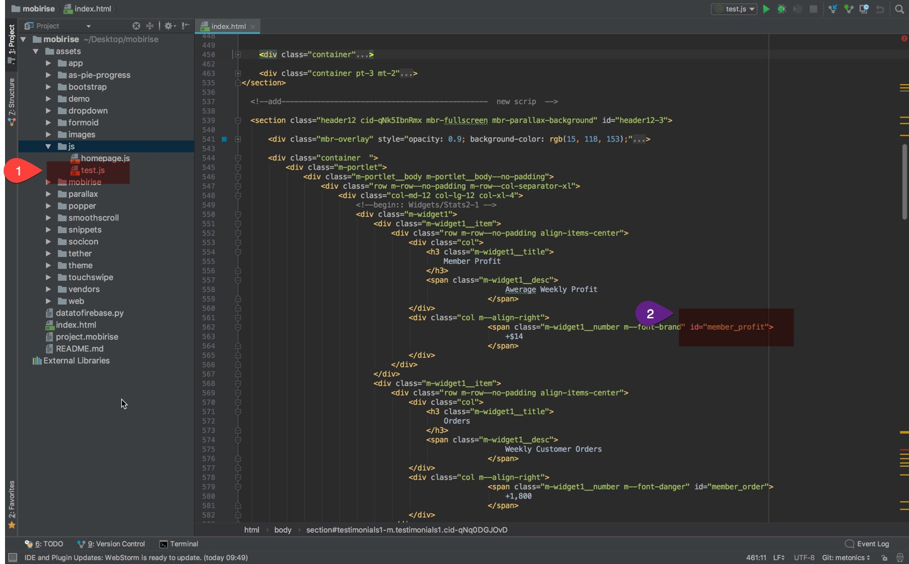

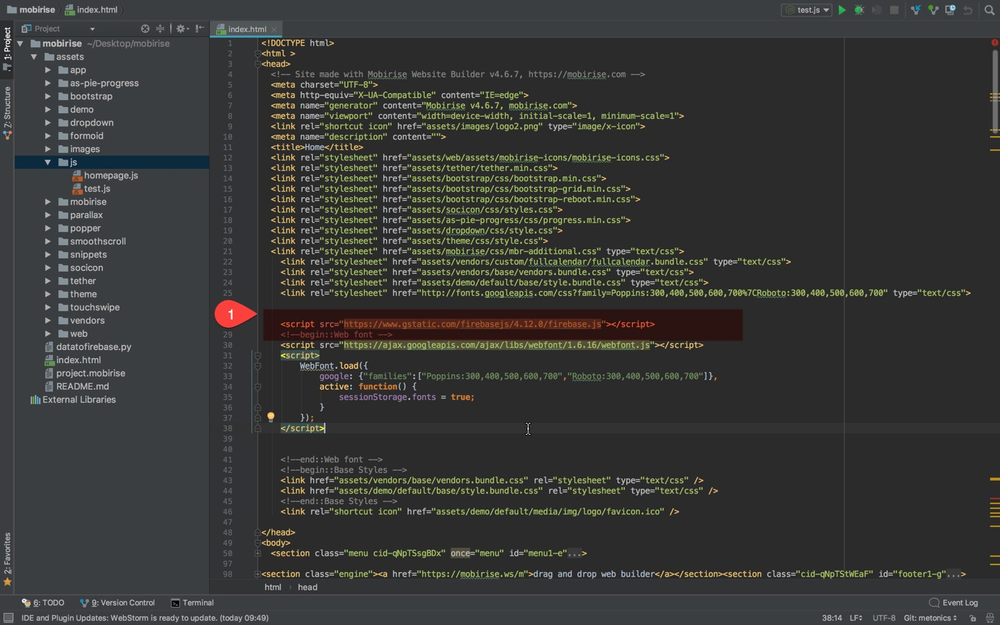

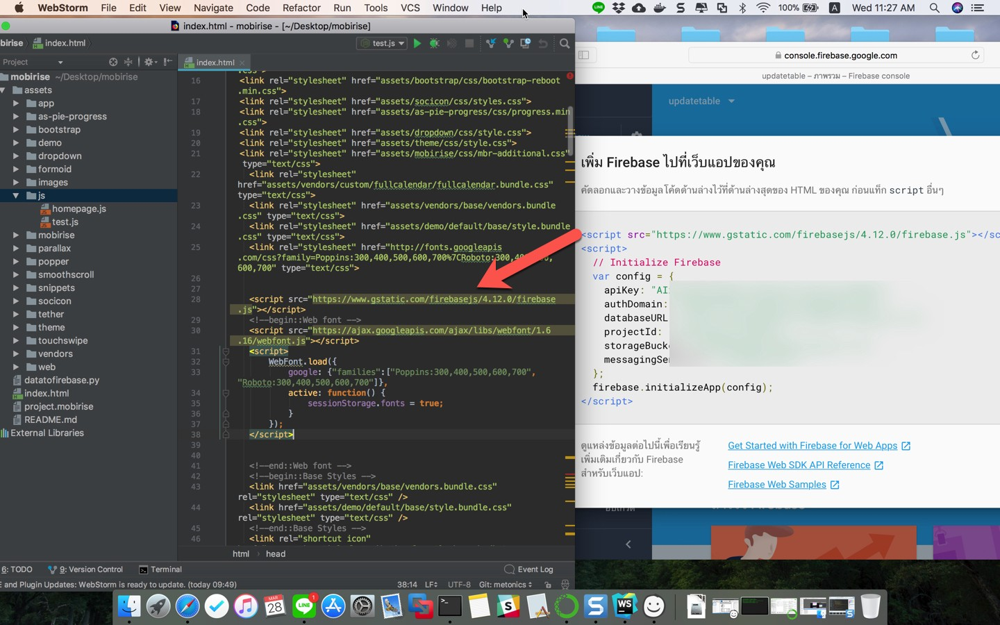

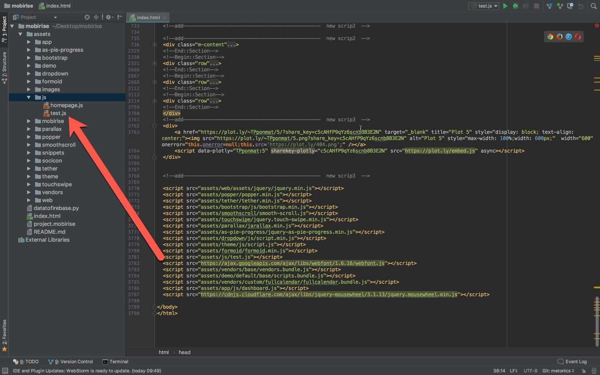

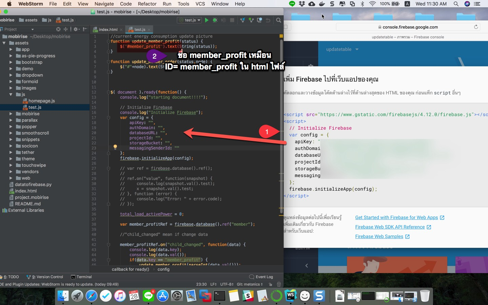

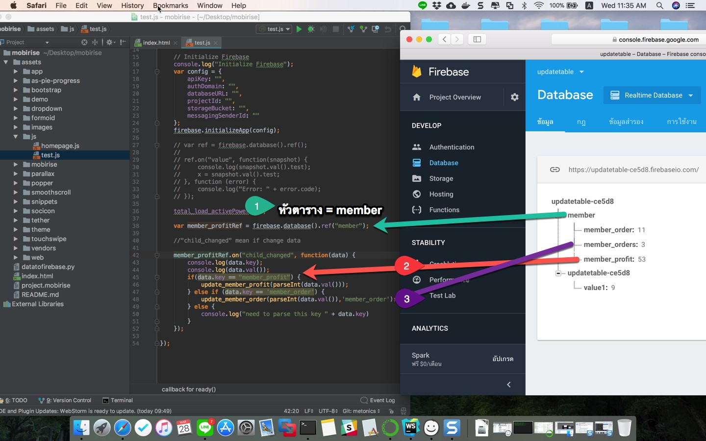

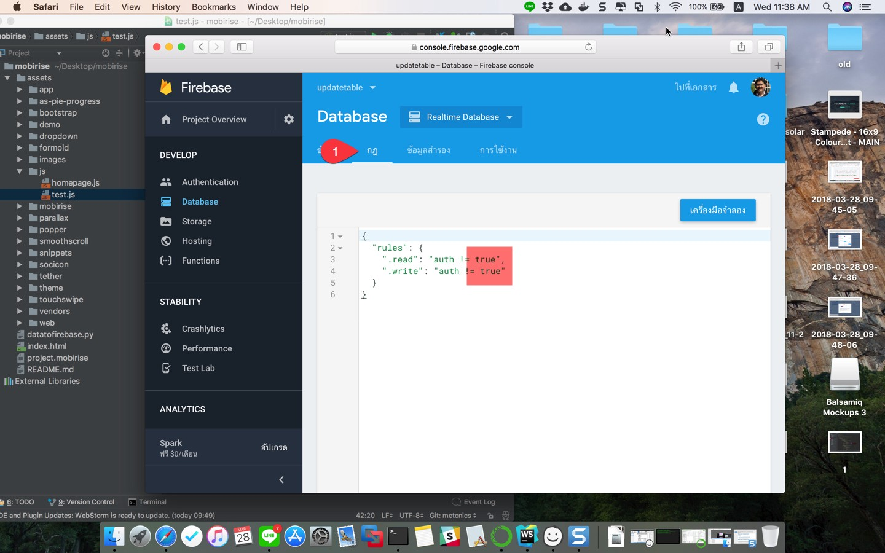

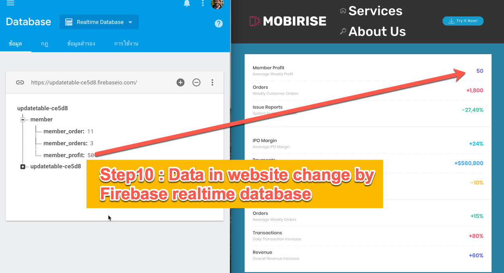
