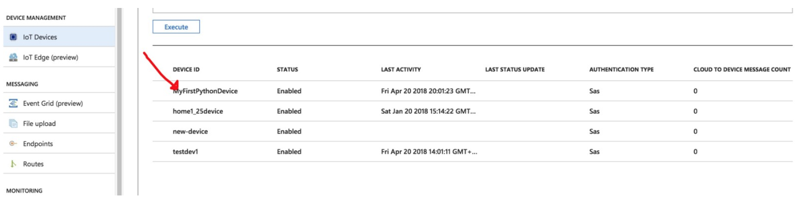
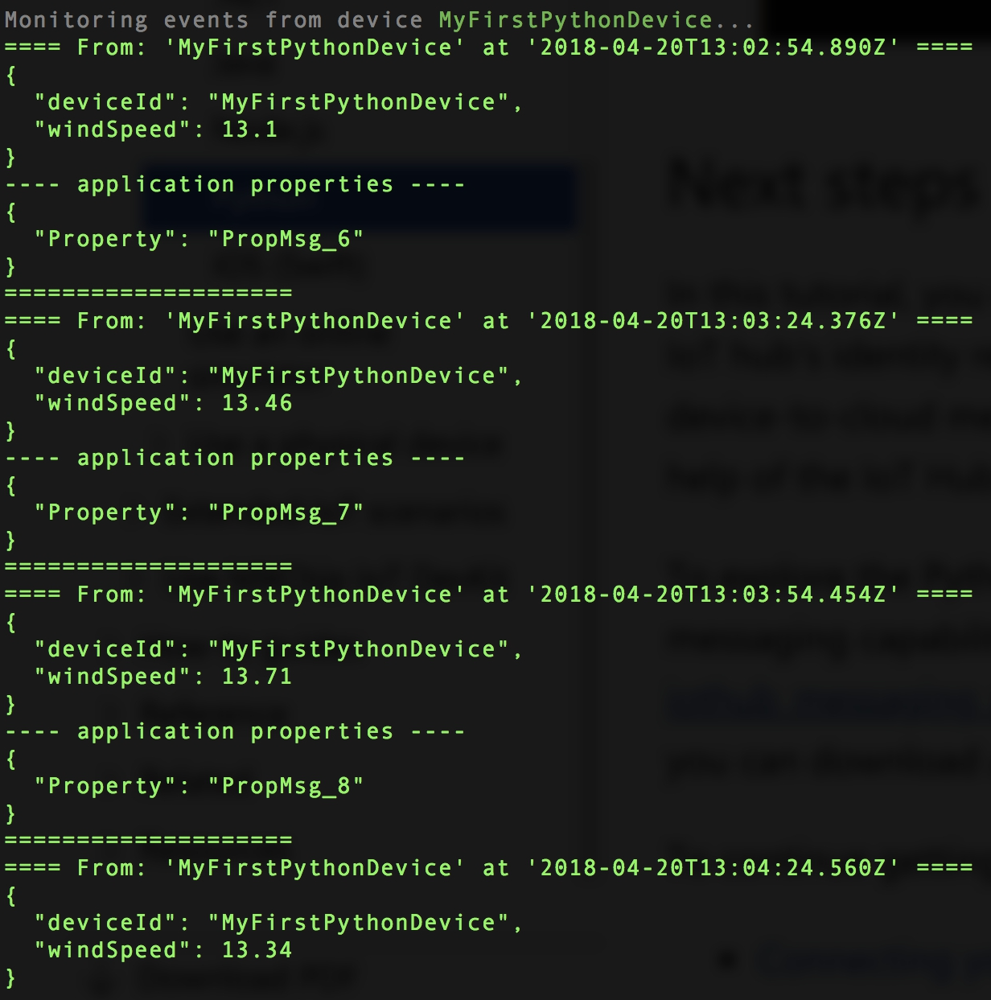

.. _getting-started:

Getting Started with Azure IoT Hub
----------------------------------

This tutorial shows you how to:

- Use the Azure portal to create an IoT hub

- Create a device identity in your IoT hub

- Create a simulated device app that sends telemetry to your solution back end

------------

At the end of this tutorial, you will have two Python apps:

- CreateDeviceIdentity.py, which creates a device identity and associated security key to connect your simulated device app.

- SimulatedDevice.py, which connects to your IoT hub with the device identity created earlier, and periodically sends a telemetry message using the MQTT protocol.

------------

Task 1: Use the Azure portal to create an IoT hub
-------

refer to this ref: https://docs.microsoft.com/en-us/azure/iot-hub/iot-hub-python-getstarted

------------

Task 2: Create a device identity in your IoT hub
-------

.. code:: Python

        pip install azure-iothub-service-client

Create a Python file named CreateDeviceIdentity.py

.. code:: Python

        import sys
        import iothub_service_client
        from iothub_service_client import IoTHubRegistryManager, IoTHubRegistryManagerAuthMethod
        from iothub_service_client import IoTHubDeviceStatus, IoTHubError

        CONNECTION_STRING = ""
        DEVICE_ID = "MyFirstPythonDevice"

        def print_device_info(title, iothub_device):
            print ( title + ":" )
            print ( "iothubDevice.deviceId                    = {0}".format(iothub_device.deviceId) )
            print ( "iothubDevice.primaryKey                  = {0}".format(iothub_device.primaryKey) )
            print ( "iothubDevice.secondaryKey                = {0}".format(iothub_device.secondaryKey) )
            print ( "iothubDevice.connectionState             = {0}".format(iothub_device.connectionState) )
            print ( "iothubDevice.status                      = {0}".format(iothub_device.status) )
            print ( "iothubDevice.lastActivityTime            = {0}".format(iothub_device.lastActivityTime) )
            print ( "iothubDevice.cloudToDeviceMessageCount   = {0}".format(iothub_device.cloudToDeviceMessageCount) )
            print ( "iothubDevice.isManaged                   = {0}".format(iothub_device.isManaged) )
            print ( "iothubDevice.authMethod                  = {0}".format(iothub_device.authMethod) )
            print ( "" )
       def iothub_createdevice():
            try:
                iothub_registry_manager =
            IoTHubRegistryManager(CONNECTION_STRING)
                auth_method =
            IoTHubRegistryManagerAuthMethod.SHARED_PRIVATE_KEY
                new_device =
            iothub_registry_manager.create_device(DEVICE_ID, "", "", auth_method)
                print_device_info("CreateDevice", new_device)

       except IoTHubError as iothub_error:
            print ( "Unexpected error {0}".format(iothub_error) )
            return
          except KeyboardInterrupt:
            print ( "iothub_createdevice stopped" )
       if __name__ == '__main__':
            print ( "" )
            print ( "Python {0}".format(sys.version) )
            print ( "Creating device using the Azure IoT Hub Service SDK for Python" )
            print ( "" )
            print ( "    Connection string = {0}".format(CONNECTION_STRING) )
            print ( "    Device ID         = {0}".format(DEVICE_ID) )
       iothub_createdevice()

------------

Task 3: Create a simulated device app that sends telemetry to your solution back end
-------

.. code:: Python

        pip install azure-iothub-device-client

Create a file named SimulatedDevice.py

.. code:: Python

        import random
        import time
        import sys
        import iothub_client
        from iothub_client import IoTHubClient, IoTHubClientError, IoTHubTransportProvider, IoTHubClientResult
        from iothub_client import IoTHubMessage, IoTHubMessageDispositionResult, IoTHubError, DeviceMethodReturnValue

        # String containing Hostname, Device Id & Device Key in the format
        CONNECTION_STRING = ""
        # choose HTTP, AMQP or MQTT as transport protocol
        PROTOCOL = IoTHubTransportProvider.MQTT
        MESSAGE_TIMEOUT = 10000
        AVG_WIND_SPEED = 10.0
        SEND_CALLBACKS = 0
        MSG_TXT = "{\"deviceId\": \"MyFirstPythonDevice\",\"windSpeed\": %.2f}"

        def send_confirmation_callback(message, result, user_context):
          global SEND_CALLBACKS
          print ( "Confirmation[%d] received for message with result = %s" % (user_context, result) )
          map_properties = message.properties()
          print ( "    message_id: %s" % message.message_id )
          print ( "    correlation_id: %s" % message.correlation_id )
          key_value_pair = map_properties.get_internals()
          print ( "    Properties: %s" % key_value_pair )
          SEND_CALLBACKS += 1
          print ( "    Total calls confirmed: %d" % SEND_CALLBACKS )

        def iothub_client_init():
          # prepare iothub client
          client = IoTHubClient(CONNECTION_STRING, PROTOCOL)
          # set the time until a message times out
          client.set_option("messageTimeout", MESSAGE_TIMEOUT)
          client.set_option("logtrace", 0)
          client.set_option("product_info", "HappyPath_Simulated-Python")
          return client

        def iothub_client_telemetry_sample_run():

        try:
              client = iothub_client_init()
              print ( "IoT Hub device sending periodic messages, press Ctrl-C to exit" )
              message_counter = 0
        while True:
                msg_txt_formatted = MSG_TXT % (AVG_WIND_SPEED + (random.random() * 4 + 2))
                # messages can be encoded as string or bytearray
                if (message_counter & 1) == 1:
                    message = IoTHubMessage(bytearray(msg_txt_formatted, 'utf8'))
                else:
                    message = IoTHubMessage(msg_txt_formatted)
                # optional: assign ids
                message.message_id = "message_%d" % message_counter
                message.correlation_id = "correlation_%d" % message_counter
                # optional: assign properties
                prop_map = message.properties()
                prop_text = "PropMsg_%d" % message_counter
                prop_map.add("Property", prop_text)

        client.send_event_async(message, send_confirmation_callback, message_counter)
                print ( "IoTHubClient.send_event_async accepted message [%d] for transmission to IoT Hub." % message_counter )

        status = client.get_send_status()
                    print ( "Send status: %s" % status )
                    time.sleep(30)

        status = client.get_send_status()
                    print ( "Send status: %s" % status )

        message_counter += 1

        except IoTHubError as iothub_error:
              print ( "Unexpected error %s from IoTHub" % iothub_error )
              return
        except KeyboardInterrupt:
              print ( "IoTHubClient sample stopped" )

        if __name__ == '__main__':
              print ( "Simulating a device using the Azure IoT Hub Device SDK for Python" )
              print ( "    Protocol %s" % PROTOCOL )
              print ( "    Connection string=%s" % CONNECTION_STRING )
        iothub_client_telemetry_sample_run()

------------

Essential Tools:
----------------

IoT Hub Explorer

Step1: install at https://github.com/Azure/iothub-explorer

