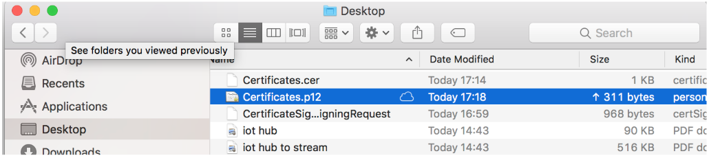
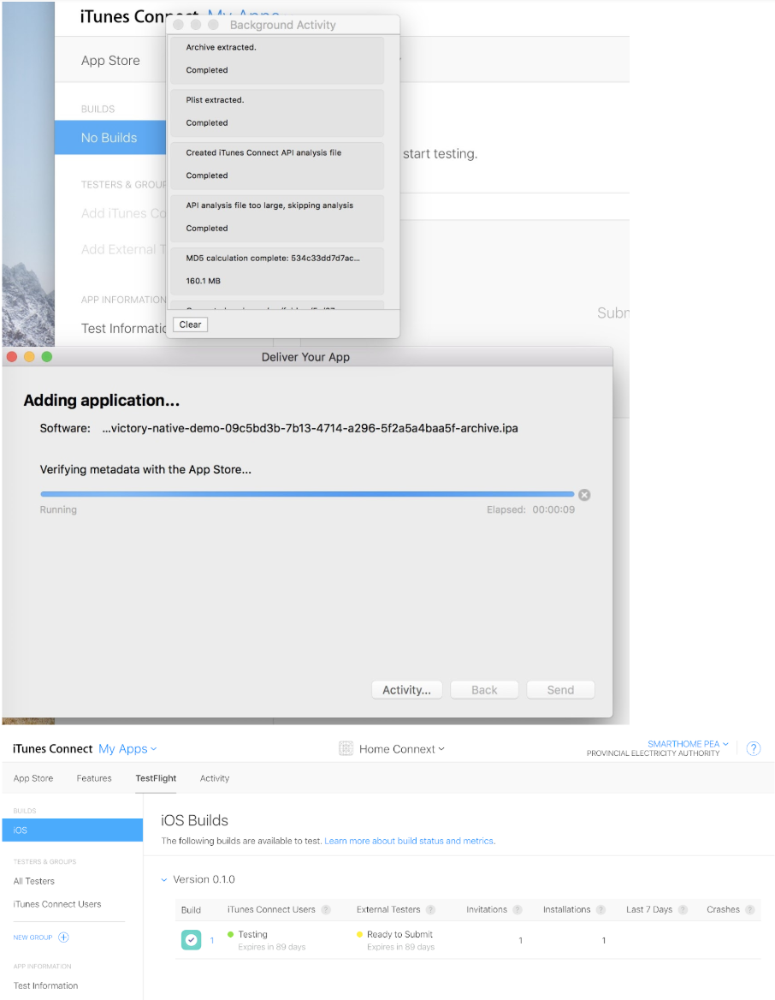
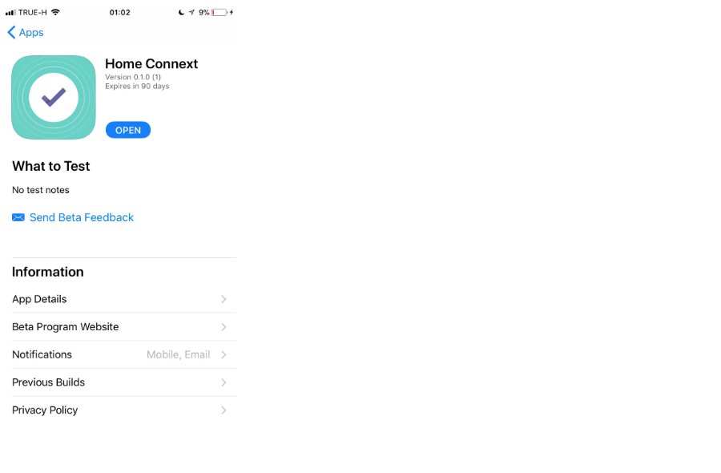

.. _index:

Publish Home Connext into App Store
===================================

การ Publish Home Connext  ขึ้น App Store

**References:**

https://docs.expo.io/versions/latest/distribution/index.html

------------

**Requirements:**

1. https://developer.apple.com

2. https://itunesconnect.apple.com/login

3. https://docs.expo.io/versions/latest/guides/detach.html#content

4. An Apple Developer account is needed to build an iOS standalone app

5. Google Play Developer account is not needed to build the Android standalone app.

username: smarthome.pea@gmail.com

password: HiVE@28Sep1960

------------

**STEP TO PUBLISH:**
====================

(1) Install exp
---------------

.. code-block:: python

 $ npm install -g exp

(2) Config App.json in your project:
------------------------------------

.. code-block:: python

          {
            "expo": {
             "name": "Your App Name",
             "icon": "./path/to/your/app-icon.png",
             "version": "1.0.0",
             "slug": "your-app-slug",
             "sdkVersion": "XX.0.0",
             "ios": {
              "bundleIdentifier": "com.yourcompany.yourappname"
            },
            "android": {
              "package": "com.yourcompany.yourappname"
              }
            }
          }

**example:**

.. code-block:: python

        {
            "expo": {
              "sdkVersion": "21.0.0",
              "orientation": "portrait",
              "privacy": "public",
              "icon": "./app.png",
              "primaryColor": "#843cf6",
              "loading": {
                "backgroundImage": "./splash.png",
                "hideExponentText": true
              },
              "androidStatusBarColor": "#843cf6",
              "androidStatusBar": {
                "barStyle": "light-content",
                "backgroundColor": "#843cf6"
              },
              "ios": {
                "bundleIdentifier": "com.pea.peasmarthomev0"
              },
              "android": {
                "package": "com.pea.peasmarthomev0"
              }

          }
        }

(3) Start the build
-------------------

.. code-block:: python

            // in your app directory to boot up the Expo packager.

            $ exp start

            // Once the app has started

            $ exp build:ios

If you choose to build for iOS

(4) How to make a p12 file for iOS
----------------------------------

You’ll need a .p12 file to publish your app on the Apple App Store

**REQUIREMENTS**

You’ll need a few things before getting started:

  - Access to a Mac computer
  - NOTE: This is a requirement from Apple
  - An Apple iOS Developer account

**STEP 1: CREATE A “.CERTSIGNINGREQUEST” (CSR) FILE**

1.1 Open Keychain Access on your Mac

1.2 open Keychain Access > Certificate Assistant > Request a Certificate From a Certificate Authority

1.3 Enter the email address and common name that  you used to register in the iOS Developer Program
NOTE: Common name should be the name of the developer as it appears in your Apple Developer Account

1.4 In the next window, for “Key Size” choose “2048 bits”

1.5 This will create and save your certSigningRequest file (CSR) to your hard drive. A public and private key will also be created in Keychain Access with the Common Name you entered earlier

------------

**STEP 2: CREATE THE “.CER” FILE IN YOUR IOS DEVELOPER ACCOUNT**

2.1 Log on to https://developer.apple.com

Click “Certificates, Identifiers & Profiles”

2.2 In the “Certificates” section at the top of the left-hand panel, click “Production” Click the “Add” (+) button at the top-right of the main panel

2.3 In the main panel, under Development, Choose “iOS App Development”

2.4 Click Continue,

Click “Choose File” & find the CSR file you’ve just made from your hard drive,

Click Generate and wait for the file to process,

Click Download to get the file, and then click the Done button at the bottom once the download has finished

------------

**STEP 3: INSTALL THE .CER AND GENERATE THE .P12**

3.1 Find the .cer file you’ve just downloaded and double-click. If the certificate hasn’t automatically been installed, you will see the following (otherwise, skip the next two steps):

3.2 Make sure the drop-down is set to “login”

- Click Add

- Open up KeyChain Access again

- Find the two profiles you created in Step 1 (with the iOS Developer common name)

- You should now be able to expand the “private key” profile, which should show the certificate you just added

3.3 Right click and click “Export 2 items…” from the popup

- In the next window, make sure the file format is a “.p12” and choose a filename and destination on your hard drive

3.4 Click Save

- Finally, you’ll be prompted to set a password – but leave these both blank

3.5 You may be asked for the administrator password of the computer at this stage (possibly twice as there are two files to export), if you do, enter the password and click OK

That’s it! You will get .p12 file here

------------

(5) If you choose to build for iOS
----------------------------------

5.1

.. code-block:: python

            exp build:ios

------------

5.2 Register APP ID

------------

5.3 Edit ‘app.json’

 After successfully build the mobile

- Copy link of the IPA to web browser and download the IPA file

- After finish downloading the IPA, upload the IPA file to iTunes Connect through ‘Application Loader’ in which you can find from the XCode menu

- use the Template Chooser to choose the IPA file to upload

------------

**TROUBLESHOOTING**
===================

1. You already have a current iOS Distribution certificate or a pending certificate request. Maximum number of certificates generated

Fix: check number of ‘iOS Distribution’ certificate, and delete one which is unnecessary

2. Reason:Multiple profiles found with the name 'com.pea.homeconnext AppStore'.  Please remove the duplicate profiles and try again. There were errors in the data supplied.

Fix: make sure the is no provisioning profile type ‘iOS Distribution’ with the same name already existing

