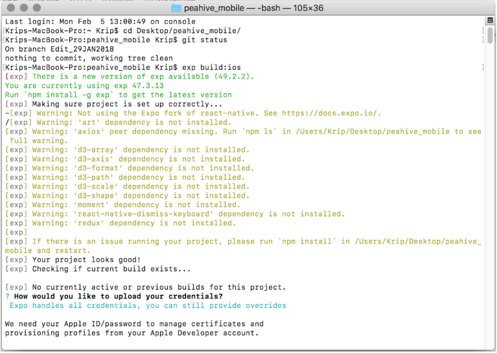
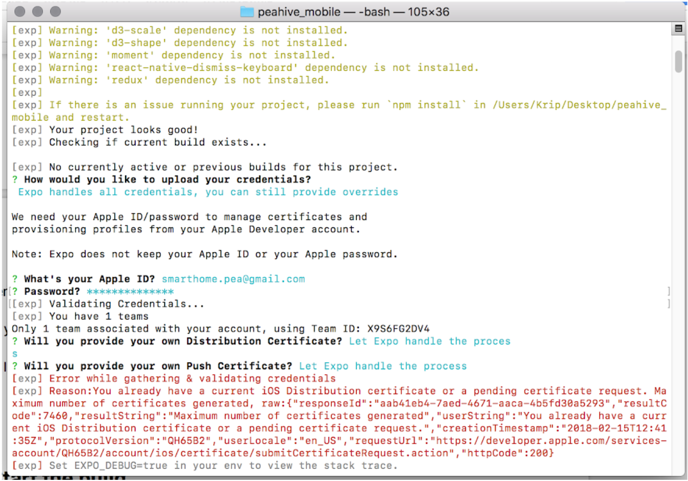
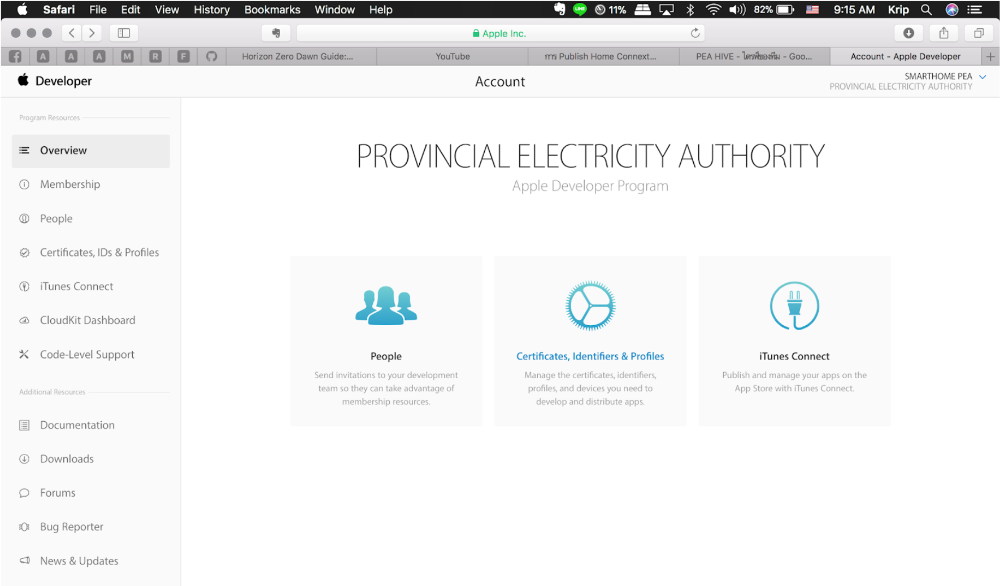
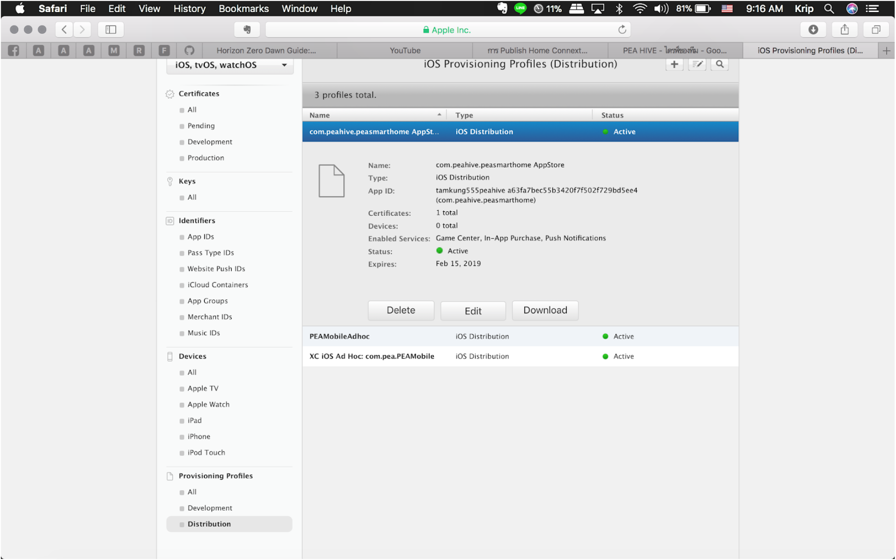
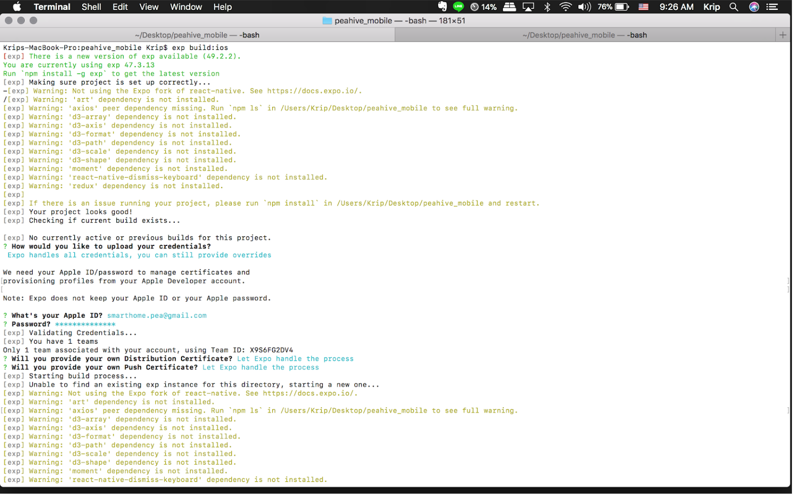
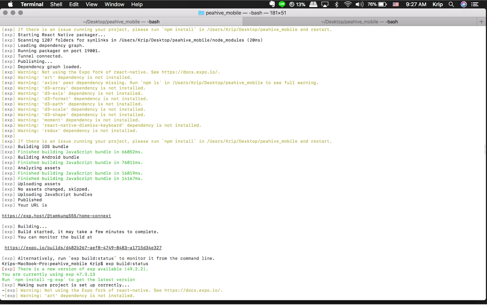
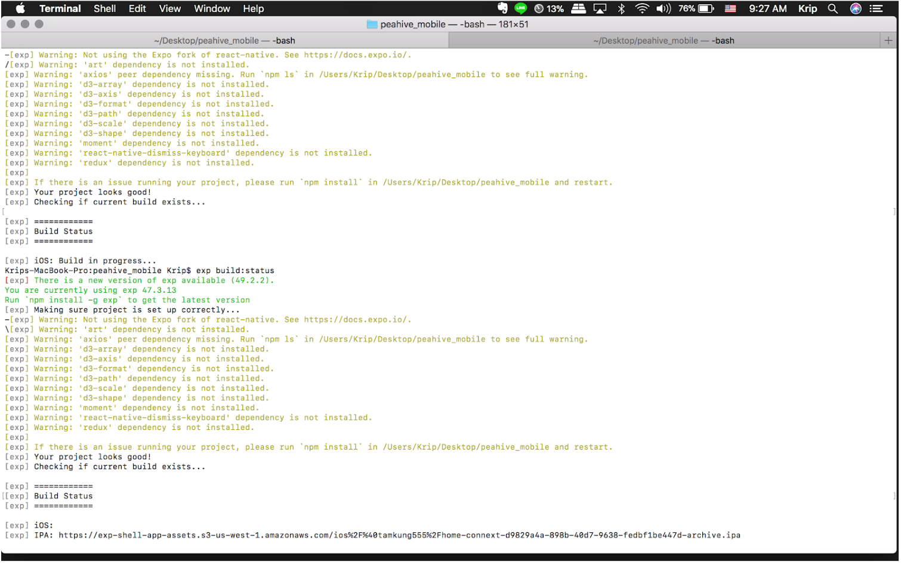

.. _index:

Publish Home Connext into App Store 2
=====================================

การ Publish Home Connext  ขึ้น App Store โดยไม่ต้องสร้าง Certificate ผ่าน KeyChain

**References:**

https://docs.expo.io/versions/latest/distribution/index.html

------------

**Requirements:**

1. https://developer.apple.com

2. https://itunesconnect.apple.com/login

3. https://docs.expo.io/versions/latest/guides/detach.html#content

4. An Apple Developer account is needed to build an iOS standalone app

5. Google Play Developer account is not needed to build the Android standalone app.

username: smarthome.pea@gmail.com

password: HiVE@28Sep1960

------------

**Step to publish:**

1. Open Terminal and go to your project folder

2. Config App.json in your project:

.. Note:: $ exp build:ios

3. Then choose “Expo handles all, credentials, you can still provide overrides”

4. Put your Apple ID (Developer Apple ID) and password

**Note:** *If you have error notification in terminal as fig* **:**

------------

You must delete **iOS Provisioning Profiles (Distribution) follow as:**

1 enter to https://developer.apple.com and login.

2. go to “Certificates, IDs & Profiles”

3. Go to Provisioning Profiles -> Distribution, so click com.peahive.peasmarthome AppStore and delete it.

4. Then, repeat in 1st step again.

5. entry this code again.

.. Note:: $ exp build:ios

if it don’t have something wrong, the screen must show follow as:

In the previous figure, Expo will create “iOS Provisioning profile” and generate IPA file (Use to upload in itune-test flight). Wait a minute!!!

**Note:** *While waiting for the IPA file to be created, we can check the status as*

.. Note:: $ exp build:status

6. Download IPA file as IPA’s url.
