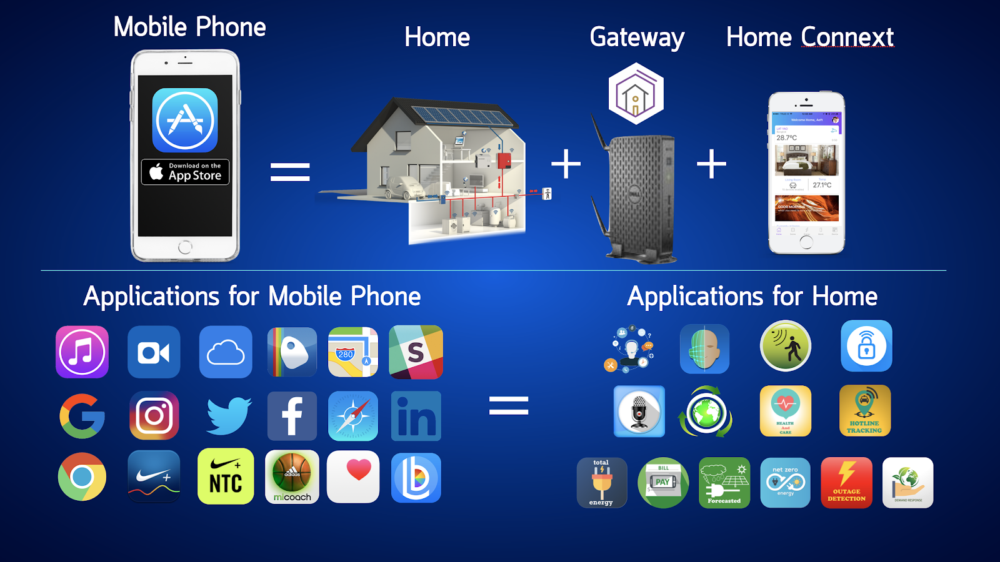

.. _application_development:

Layer 5:Application Development

Layer 5: Application Development
=================================

5.1 Security Applications
-------------------------
5.1.1 Face Detection + Smart Door Lock App

5.1.2 Human Detection App

5.2 Comfort/Convenient/Entertainment Applications
--------------------------------------------------
5.2.1 Alexa Voice Control

5.2.2 Chatbot

5.2.3 Smart Modes: Good Morning, Good Night, Good Bye, I’m Back, Eco Mode

5.3 Healthcare Applications
---------------------------

5.3.1 Indoor Environment Alert

5.4 Energy Applications
------------------------
5.4.1 Energy Consumption Calculation

การคำนวณการใช้พลังงานไฟฟ้า (Energy Consumption) สามารถคำนวณได้จากการใช้ Smart Meter รวมถึงจากเครื่องใช้ไฟฟ้าหรืออุปกรณ์อัจฉริยะที่สามารถให้ข้อมูลการใช้พลังงานได้ ในที่นี้อาศัย EnergyBillApp Agent สำหรับคำนวณการใช้พลังงานไฟฟ้าและค่าไฟฟ้าโดยประมาณได้ ซึ่งแสดงดังลิงก์ต่อไปนี้
https://github.com/kwarodom/hive_os/tree/dev/Applications/code/EnergyBillAppAgent

5.4.1.1 EnergyBillApp Agent

สำหรับ EnergyBillApp Agent สามารถปรับแต่งได้จากไฟล์ energybillappagent.launch.json ซึ่งแสดงดังลิงก์ต่อไปนี้

https://github.com/kwarodom/hive_os/blob/dev/Applications/code/EnergyBillAppAgent/energybillappagent.launch.json

จากไฟล์ agent.py เราสามารถเลือกอุปกรณ์สำหรับคำนวณการใช้พลังงานไฟฟ้าได้ จากรูปที่ 5.4.1.1 แสดงการกำหนด Topic อุปกรณ์ที่ต้องการ ในที่นี้คืออุปกรณ์ประเภท power meter ชื่อ 5PMCP009

.. Note:: @matching.match_exact('/agent/ui/power_meter/device_status_response/bemoss/999/5PMCP009')

-รูปที่ 5.4.1.1 การกำหนด Topic อุปกรณ์ที่ต้องการ สำหรับ EnergyBillApp Agent

ขั้นตอนการทำงานของ EnergyBillApp Agent ประกอบด้วย

ขั้นตอนที่ 1:  ที่ Project view ไปที่ bemoss_os -> Applications -> code -> EnergyBillAppAgent -> energybillapp เลือกไฟล์ agent.py

ขั้นตอนที่ 2:  ไปที่ menu bar เลือก Run -> Edit configurations…

ขั้นตอนที่ 3:  ภายใต้ Python Run กด + เพื่อสร้าง configuration file ชื่อ energybillapp

ขั้นตอนที่ 4:  ที่ configuration tab กำหนดค่าดังนี้:

                     Script: เลือกตำแหน่งของไฟล์ agent.py

                     Project: bemoss_os

                     Python interpreter: python 2.7.6 virtualenv

                     Working Directory: ~/workspace/bemoss_os

                     Environment variables: กำหนดดังตารางที่ 5.4.1.1

=============================== =========================
Name                            Value
=============================== =========================
PYTHONUNBUFFERED                1
AGENT_PUB_ADDR                  ipc:///~/.volttron/run/publish
AGENT_SUB_ADDR                  ipc:///~/.volttron/run/subscribe
AGENT_CONFIG                    ให้ copy path ของไฟล์ energybillappagent.launch.json
=============================== =========================
ขั้นตอนที่ 5:  กด Run เพื่อเริ่มการทำงาน EnergyBillApp Agent

5.4.2 Energy Bill Estimation
  การประมาณค่าไฟฟ้า (Energy Bill Estimation) สามารถคำนวณได้จากการใช้ Smart Meter รวมถึงเครื่องใช้ไฟฟ้าหรืออุปกรณ์อัจฉริยะที่สามารถให้ข้อมูลการใช้พลังงานได้ ในที่นี้อาศัย EnergyBillApp Agent และ GridApp Agent ซึ่งใช้สำหรับกำหนดอัตราค่าไฟฟ้า ซึ่งแสดงดังลิงก์ต่อไปนี้
  
