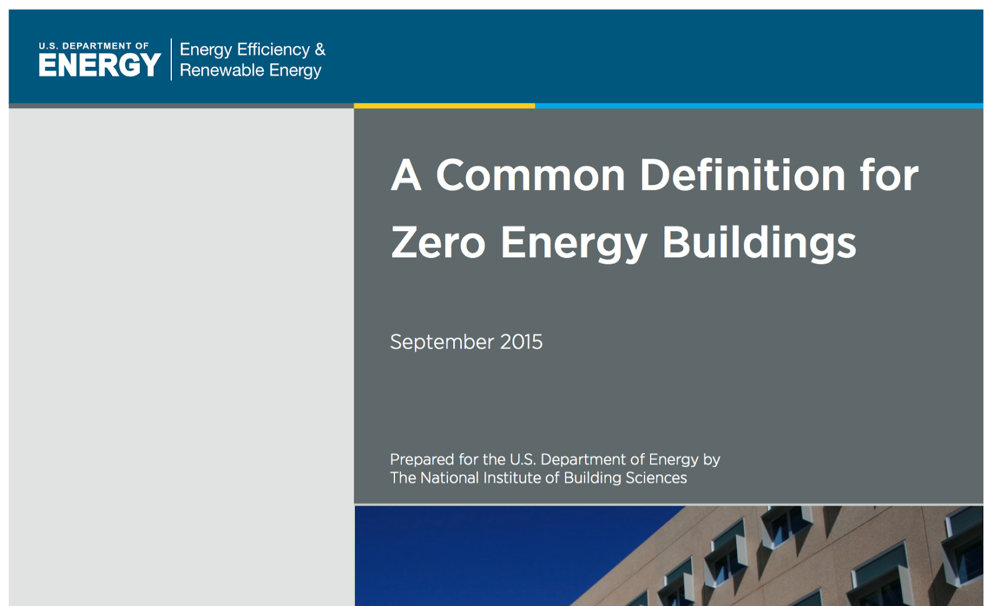
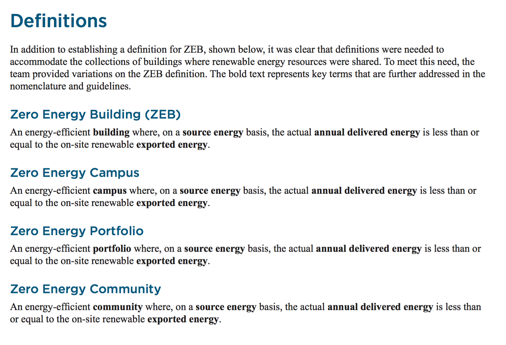
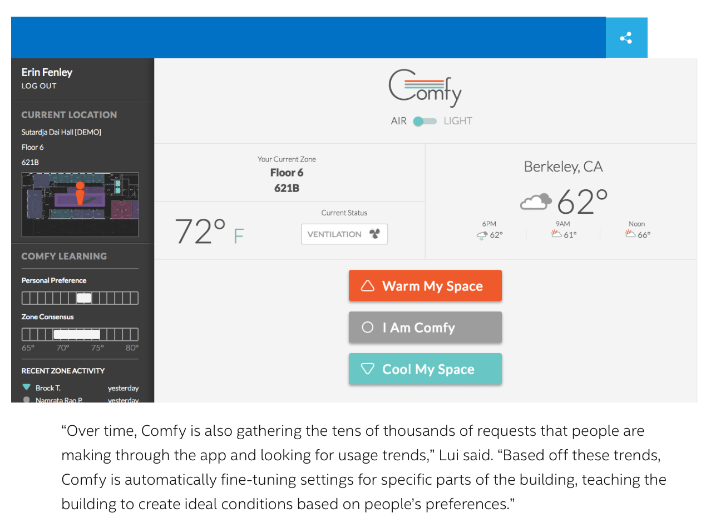

.. _application_development:

Layer 5:Application Development

Layer 5: Application Development
=================================

.. image:: ../img/layer5/AppDep.png
   :width: 100%

5.1 Security Applications
-------------------------
5.1.1 Face Detection + Smart Door Lock App

5.1.2 Human Detection App

5.2 Comfort/Convenient/Entertainment Applications
--------------------------------------------------
5.2.1 Alexa Voice Control

5.2.2 Chatbot

5.2.3 Smart Modes: Good Morning, Good Night, Good Bye, I’m Back, Eco Mode

5.3 Healthcare Applications
---------------------------

5.3.1 Indoor Environment Alert

5.4 Energy Applications
------------------------
5.4.1 Energy Consumption Calculation

การคำนวณการใช้พลังงานไฟฟ้า (Energy Consumption) สามารถคำนวณได้จากการใช้ Smart Meter รวมถึงจากเครื่องใช้ไฟฟ้าหรืออุปกรณ์อัจฉริยะที่สามารถให้ข้อมูลการใช้พลังงานได้ ในที่นี้อาศัย EnergyBillApp Agent สำหรับคำนวณการใช้พลังงานไฟฟ้าและค่าไฟฟ้าโดยประมาณได้ ซึ่งแสดงดังลิงก์ต่อไปนี้
https://github.com/kwarodom/hive_os/tree/dev/Applications/code/EnergyBillAppAgent

5.4.1.1 EnergyBillApp Agent

สำหรับ EnergyBillApp Agent สามารถปรับแต่งได้จากไฟล์ energybillappagent.launch.json ซึ่งแสดงดังลิงก์ต่อไปนี้

https://github.com/kwarodom/hive_os/blob/dev/Applications/code/EnergyBillAppAgent/energybillappagent.launch.json

จากไฟล์ agent.py เราสามารถเลือกอุปกรณ์สำหรับคำนวณการใช้พลังงานไฟฟ้าได้ จากรูปที่ 5.4.1.1 แสดงการกำหนด Topic อุปกรณ์ที่ต้องการ ในที่นี้คืออุปกรณ์ประเภท power meter ชื่อ 5PMCP009

.. Note:: @matching.match_exact('/agent/ui/power_meter/device_status_response/bemoss/999/5PMCP009')

*รูปที่ 5.4.1.1 การกำหนด Topic อุปกรณ์ที่ต้องการ สำหรับ EnergyBillApp Agent*

-----------

ขั้นตอนการทำงานของ EnergyBillApp Agent ประกอบด้วย

ขั้นตอนที่ 1:  ที่ Project view ไปที่ bemoss_os -> Applications -> code -> EnergyBillAppAgent -> energybillapp เลือกไฟล์ agent.py

ขั้นตอนที่ 2:  ไปที่ menu bar เลือก Run -> Edit configurations…

ขั้นตอนที่ 3:  ภายใต้ Python Run กด + เพื่อสร้าง configuration file ชื่อ energybillapp

ขั้นตอนที่ 4:  ที่ configuration tab กำหนดค่าดังนี้:

                     Script: เลือกตำแหน่งของไฟล์ agent.py

                     Project: bemoss_os

                     Python interpreter: python 2.7.6 virtualenv

                     Working Directory: ~/workspace/bemoss_os

                     Environment variables: กำหนดดังตารางที่ 5.4.1.1

=============================== =========================
Name                            Value
=============================== =========================
PYTHONUNBUFFERED                1
AGENT_PUB_ADDR                  ipc:///~/.volttron/run/publish
AGENT_SUB_ADDR                  ipc:///~/.volttron/run/subscribe
AGENT_CONFIG                    ให้ copy path ของไฟล์ energybillappagent.launch.json
=============================== =========================
ขั้นตอนที่ 5:  กด Run เพื่อเริ่มการทำงาน EnergyBillApp Agent

5.4.2 Energy Bill Estimation
  การประมาณค่าไฟฟ้า (Energy Bill Estimation) สามารถคำนวณได้จากการใช้ Smart Meter รวมถึงเครื่องใช้ไฟฟ้าหรืออุปกรณ์อัจฉริยะที่สามารถให้ข้อมูลการใช้พลังงานได้ ในที่นี้อาศัย EnergyBillApp Agent และ GridApp Agent ซึ่งใช้สำหรับกำหนดอัตราค่าไฟฟ้า ซึ่งแสดงดังลิงก์ต่อไปนี้

  https://github.com/kwarodom/hive_os/tree/dev/Applications/code/EnergyBillAppAgent

  https://github.com/kwarodom/hive_os/tree/dev/Applications/code/GridAppAgent

5.4.2.1 GridApp Agent
  สำหรับ GridApp Agent สามารถปรับแต่งโครงสร้างรูปแบบจากไฟล์ gridappagent.launch.json ซึ่งแสดงดังลิงก์ต่อไปนี้

  https://github.com/kwarodom/hive_os/blob/dev/Applications/code/GridAppAgent/gridappagent.launch.json

  ปัจจุบันรูปแบบอัตราค่าไฟฟ้าในประเทศไทยสามารถอ้างอิงได้จากการไฟฟ้านครหลวง (กฟน.) และการไฟฟ้าส่วนภูมิภาค (กฟภ.) ซึ่งแสดงดังลิงก์ต่อไปนี้

  การไฟฟ้านครหลวง: http://www.mea.or.th/profile/109/111

  การไฟฟ้าส่วนภูมิภาค: http://esd.pea.co.th/pdf/electricity_rate_58_02.pdf

  จากไฟล์ agent.py ในส่วนฟังก์ชัน get_current_electricity_price() เราสามารถสร้างอัลกอริทึมสำหรับอัตราค่าไฟฟ้าประเภทต่างๆได้ดังแสดงในรูปที่ 5.4.2.1

.. Note:: def get_current_electricity_price(self):

*รูปที่ 5.4.2.1 ฟังก์ชันสำหรับสร้างอัตราค่าไฟฟ้าประเภทต่างๆ*

-----------

ขั้นตอนการทำงานของ GridApp Agent ประกอบด้วย

ขั้นตอนที่ 1:  ที่ Project view ไปที่ bemoss_os -> Applications -> code -> GridAppAgent -> gridapp เลือกไฟล์ agent.py

ขั้นตอนที่ 2:  ไปที่ menu bar เลือก Run -> Edit configurations…

ขั้นตอนที่ 3:  ภายใต้ Python Run กด + เพื่อสร้าง configuration file ชื่อ gridapp

ขั้นตอนที่ 4:  ที่ configuration tab กำหนดค่าดังนี้

                     Script: เลือกตำแหน่งของไฟล์ agent.py

                     Project: bemoss_os

                     Python interpreter: python 2.7.6 virtualenv

                     Working Directory: ~/workspace/bemoss_os

                     Environment variables: กำหนดดังตารางที่ 5.4.2.1

*ตารางที่ 5.4.2.1 การกำหนด Environment variables*

==================== ====================
     Name                Value
==================== ====================
PYTHONUNBUFFERED     1
AGENT_PUB_ADDR       ipc:///~/.volttron/run/publish
AGENT_SUB_ADDR       ipc:///~/.volttron/run/subscribe
AGENT_CONFIG         ให้ copy path ของไฟล์ gridappagent.launch.json
==================== ====================

-----------

ขั้นตอนที่ 5:  กด Run เพื่อเริ่มการทำงาน GridApp Agent

5.4.2.2 EnergyBillApp Agent

สำหรับ EnergyBillApp Agent สามารถปรับแต่งได้จากไฟล์ energybillappagent.launch.json ซึ่งแสดงดังลิงก์ต่อไปนี้

https://github.com/kwarodom/hive_os/blob/dev/Applications/code/EnergyBillAppAgent/energybillappagent.launch.json

จากไฟล์ agent.py เราสามารถเลือกอุปกรณ์สำหรับคำนวณการใช้พลังงานไฟฟ้าได้ จากรูปที่ 5.4.2.2 แสดงการกำหนด Topic อุปกรณ์ที่ต้องการ ในที่นี้คืออุปกรณ์ประเภท power meter ชื่อ 5PMCP009 พร้อมทั้งกำหนด Topic ดังแสดงในรูปที่ 5.4.2.3 เพื่อดึงค่าอัตราค่าไฟฟ้า มาใช้สำหรับการคำนวณค่าไฟฟ้าต่อไป

.. Note:: @matching.match_exact(‘/agent/ui/power_meter/device_status_response/bemoss/999/5PMCP009’)

*รูปที่ 5.4.2.2 การกำหนด Topic อุปกรณ์ที่ต้องการ สำหรับ EnergyBillApp Agent*

.. Note:: @matching.match_start('/app/ui/grid/update_ui/bemoss/999')

*รูปที่ 5.4.2.3 การกำหนด Topic อัตราค่าไฟฟ้า สำหรับ EnergyBillApp Agent*

-----------

ขั้นตอนการทำงานของ EnergyBillApp Agent ประกอบด้วย

ขั้นตอนที่ 1:  ที่ Project view ไปที่ bemoss_os -> Applications -> code -> EnergyBillAppAgent -> energybillapp เลือกไฟล์ agent.py

ขั้นตอนที่ 2:  ไปที่ menu bar เลือก Run -> Edit configurations…

ขั้นตอนที่ 3:  ภายใต้ Python Run กด + เพื่อสร้าง configuration file ชื่อ energybillapp

ขั้นตอนที่ 4:  ที่ configuration tab กำหนดค่าดังนี้

                     Script: เลือกตำแหน่งของไฟล์ agent.py

                     Project: bemoss_os

                     Python interpreter: python 2.7.6 virtualenv

                     Working Directory: ~/workspace/bemoss_os

                     Environment variables: กำหนดดังตารางที่ 5.4.2.2

*ตารางที่ 5.4.2.2 การกำหนด Environment variables*

==================== ====================
     Name                Value
==================== ====================
PYTHONUNBUFFERED     1
AGENT_PUB_ADDR       ipc:///~/.volttron/run/publish
AGENT_SUB_ADDR       ipc:///~/.volttron/run/subscribe
AGENT_CONFIG         ให้ copy path ของไฟล์ energybillappagent.launch.json
==================== ====================

-----------

ขั้นตอนที่ 5:  กด Run เพื่อเริ่มการทำงาน EnergyBillApp Agent

5.4.3 Load Prediction
การพยากรณ์โหลด (Load Prediction) ในที่นี้อาศัย LoadForecastApp Agent โดยใช้ข้อมูลที่จัดเก็บภายในฐานข้อมูล ได้แก่ โหลด(จาก PowerMeter Agent) สภาพอากาศ (จาก Weather Agent) ฯลฯ ซึ่งแสดงดังลิงก์ต่อไปนี้

https://github.com/kwarodom/hive_os/tree/dev/Applications/code/LoadForecastAppAgent

สำหรับ LoadForecastApp Agent สามารถปรับแต่งได้จากไฟล์ loadforecastappagent. launch.json ซึ่งแสดงดังลิงก์ต่อไปนี้

https://github.com/kwarodom/hive_os/blob/dev/Applications/code/LoadForecastAppAgent/loadforecastappagent.launch.json

จากไฟล์ agent.py ในส่วนฟังก์ชัน get_load_forecast() เราสามารถสร้างอัลกอริทึมสำหรับพยากรณ์โหลดได้ดังแสดงในรูปที่ 5.4.3.1

.. Note:: def  get_load_forecast(self):

*รูปที่ 5.4.3.1 ฟังก์ชันสำหรับสร้างอัลกอริทึมพยากรณ์โหลด*

-----------

ขั้นตอนการทำงานของ LoadForecastApp Agent ประกอบด้วย

ขั้นตอนที่ 1:  ที่ Project view ไปที่ bemoss_os -> Applications -> code -> LoadForecastAppAgent -> loadforecastapp เลือกไฟล์ agent.py

ขั้นตอนที่ 2:  ไปที่ menu bar เลือก Run -> Edit configurations…

ขั้นตอนที่ 3:  ภายใต้ Python Run กด + เพื่อสร้าง configuration file ชื่อ loadforecastapp

ขั้นตอนที่ 4:  ที่ configuration tab กำหนดค่าดังนี้

                     Script: เลือกตำแหน่งของไฟล์ agent.py

                     Project: bemoss_os

                     Python interpreter: python 2.7.6 virtualenv

                     Working Directory: ~/workspace/bemoss_os

                     Environment variables: กำหนดดังตารางที่ 5.4.3.1

*ตารางที่ 5.4.3.1 การกำหนด Environment variables*

==================== ====================
     Name                Value
==================== ====================
PYTHONUNBUFFERED     1
AGENT_PUB_ADDR       ipc:///~/.volttron/run/publish
AGENT_SUB_ADDR       ipc:///~/.volttron/run/subscribe
AGENT_CONFIG         ให้ copy path ของไฟล์ loadforecastappagent.launch.json
==================== ====================

-----------

ขั้นตอนที่ 5:  กด Run เพื่อเริ่มการทำงาน LoadForecastApp Agent

5.4.4 Solar Prediction

การพยากรณ์กําลังไฟฟ้าของระบบเซลล์แสงอาทิตย์ (Solar Prediction) ในที่นี้อาศัย SolarForecastApp Agent โดยใช้ข้อมูลที่จัดเก็บภายในฐานข้อมูล ได้แก่ กําลังไฟฟ้าของระบบเซลล์แสงอาทิตย์ (จาก Inverter Agent) สภาพอากาศ (จาก Weather Agent) ฯลฯ ซึ่งแสดงดังลิงก์ต่อไปนี้

https://github.com/kwarodom/hive_os/tree/dev/Applications/code/SolarForecastAppAgent

สำหรับ SolarForecastApp Agent สามารถปรับแต่งได้จากไฟล์ solarforecastappagent.launch.json ซึ่งแสดงดังลิงก์ต่อไปนี้

https://github.com/kwarodom/hive_os/blob/dev/Applications/code/SolarForecastAppAgent/solarforecastappagent.launch.json

จากไฟล์ agent.py ในส่วนฟังก์ชัน get_solar_forecast() เราสามารถสร้างอัลกอริทึมสำหรับพยากรณ์โหลดได้ดังแสดงในรูปที่ 5.4.4.1

.. Note:: def  get_solar_forecast(self):

*รูปที่ 5.4.4.1 ฟังก์ชันสำหรับสร้างอัลกอริทึมพยากรณ์กําลังไฟฟ้าของระบบเซลล์แสงอาทิตย์*

-----------

ขั้นตอนการทำงานของ SolarForecastApp Agent ประกอบด้วย

ขั้นตอนที่ 1:  ที่ Project view ไปที่ bemoss_os -> Applications -> code -> SolarForecastAppAgent -> solarforecastapp เลือกไฟล์ agent.py

ขั้นตอนที่ 2:  ไปที่ menu bar เลือก Run -> Edit configurations…

ขั้นตอนที่ 3:  ภายใต้ Python Run กด + เพื่อสร้าง configuration file ชื่อ solarforecastapp

ขั้นตอนที่ 4:  ที่ configuration tab กำหนดค่าดังนี้

                     Script: เลือกตำแหน่งของไฟล์ agent.py

                     Project: bemoss_os

                     Python interpreter: python 2.7.6 virtualenv

                     Working Directory: ~/workspace/bemoss_os

                     Environment variables: กำหนดดังตารางที่ 5.4.4.1

*ตารางที่ 5.4.4.1 การกำหนด Environment variables*

==================== ====================
     Name                Value
==================== ====================
PYTHONUNBUFFERED     1
AGENT_PUB_ADDR       ipc:///~/.volttron/run/publish
AGENT_SUB_ADDR       ipc:///~/.volttron/run/subscribe
AGENT_CONFIG         ให้ copy path ของไฟล์ solarforecastappagent.launch.json
==================== ====================

-----------

ขั้นตอนที่ 5:  กด Run เพื่อเริ่มการทำงาน SolarForecastApp Agent

5.4.5 Net-Zero Energy Building

.. role:: red
:red:`Reading Rainbow Tip:`  Think about the most important events in the story. Be careful not to re-tell the whole story but give enough detail so that the plot makes sense to someone who hasn’t read the book.

-----------

5.5 Data Analytics
------------------

5.5.1 Energy Consumption Calculation

-----------

5.6 IoT Application Examples
----------------------------

5.6.1 Hack Amazon Dash to control Philips HUE Strip through SmartThings

https://www.youtube.com/watch?v=cU6lJntttsA&t=93s

.. role:: red
:red:`Reading Rainbow Tip:` Think about the most important events in the story. Be careful not to re-tell the whole story but give enough detail so that the plot makes sense to someone who hasn’t read the book.
