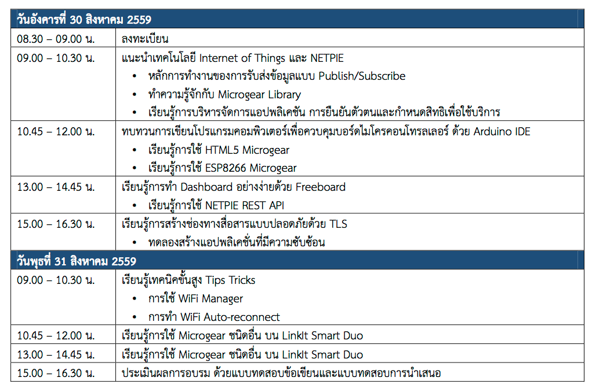

.. _pea_hive_training:

PEA HiVE Training
=================

Training # 1 Python Training 2559
---------------------------------

Instructor: Warodom Khamphanchai, Ph.D.

Students: http://bit.ly/2Ak0NG2

Training # 2 Python Training ​[6-8 ธันวาคม 2560]
----------------------------------------------
Instructor: Warodom Khamphanchai, Ph.D., Teerapong Ponmat, Nonthachai Yoothai,
Krip, Phanumat,

https://github.com/kwarodom/pea_python_training

https://docs.google.com/forms/d/e/1FAIpQLSf8sNlVKnAuOd4vCeIJ58TcE-LY4GEI7i1Iy626Xcfj7l1dUQ/viewform?usp=sf_link

Training # 3 Netpie Training ​[30-31 สิงหาคม 2559]
-----------------------------------------------

