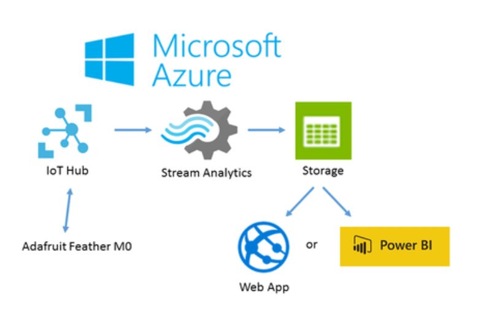

.. _index:

Azure IoT with Python
=====================

1. install python sdk
---------------------

**1.1 check cmake and gcc in env**

cmake –version

gcc –version

------------

**1.2 install A Python SDK for connecting devices to Microsoft Azure IoT services**

https://github.com/Azure/azure-iot-sdk-python

------------

**1.3 git clone --recursive**

https://github.com/Azure/azure-iot-sdk-python.git

.. Note:: *–recursive can clone anathor rapo to folder c @ 3290e56

------------

**1.4 Setup and build at folder**

azure-iot-sdk-python/build_all/linux/

in link

https://github.com/Azure/azure-iot-sdk-python/blob/master/doc/python-devbox-setup.md

------------

2. test publish mqtt
--------------------

**2.1 create IoT hub in AZURE**

------------

**2.2 publish mqtt to Azure**

2.2.1 create iot device in Azure

2.2.2 change code in python sample file

CONNECTION_STRING = “HostName= — — -.azure-

devices.net;DeviceId=CoolingSampleDevice_0925;SharedAccessKey= — —

KlOAujkFakeqs2U46GCHybT — -=”

------------

**2.3 Subscribe mqtt to Azure**

2.3.1. create stream process

2.3.2 create service bus topic,

and add bus topic (name home1)

2.3.3 modify stream process (input, Query,output)

2.3.4 select input with iothub name

2.3.5 Query

2.3.6 Output

add output with Hive02 by select output in servicebus name(Hive02) and topic name(home1)

------------

**2.4 test subscribe data by python**

------------
