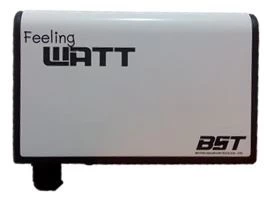

.._devices:

Devices
==================

1.        AC Daikin Urusara 7
-----------------------------

- Specifications
----------------

===================== ===========
Device Name           Urusara 7
Status                UNCERTIFIED
Model(s)
Manufacturer          Daikin
Region
Protocol
Type                  AC
Power Source          220V/1Phase/50Hz
Dimensions            595 x 795 x 300
Color                 White
Repeater
Operating Temperature
Capabilities
Amount
===================== ===========

2.        Aeon Multisensor 6
-----------------------------

- Specifications
----------------

===================== ===========
Device Name           Aeon Multisensor 6
Status                UNCERTIFIED
Model(s)              ZW100-A
Manufacturer          Aeon / Aeotec
Region                US
Protocol              Z-Wave
Type                  Multi Sensor
Power Source          2 CR123A batteries or USB cord
Dimensions            6 x 6 x 6 inches
Color                 White
Repeater
Operating Temperature
Capabilities          Motion, temp, humidity, illuminance, UV index, configuration, sensor, battery
Amount                 0
===================== ===========

3.        Amazon Echo
-----------------------------

- Specifications
----------------

===================== =============================================================================
Device Name           Amazon Echo
Status                UNCERTIFIED
Model(s)              SK705DI
Manufacturer          Amazon
Region                US
Protocol
Type                  Hands-free Speaker
Power Source          Power adapter
Dimensions            9.3 x 3.3 x 3.3 inches
Color                 Black
Repeater
Operating Temperature
Capabilities          Ask questions, Check calendar, Connect Bluetooth devices,
                      Control music,Control smart home devices,
                      Control the color of smart lights, Discover music,
                      Find local businesses and restaurants, Find traffic information,
                      Get weather updates, Hear the news, Listen to Audible audiobooks,
                      Listen to Amazon Music, Listen to Kindle books, Listen to podcasts and radio,
                      Request Music, Shopping, Set timers and alarms, To-dos lists
Amount
===================== =============================================================================

4.        Aruba
-----------------------------

- Specifications
----------------

===================== ===========
Device Name           Aruba Instant, Secure Core and L7 Firewall
Status                UNCERTIFIED
Model(s)
Manufacturer          HPE Aruba
Region
Protocol              Home Router
Type
Power Source          220V/1Phase/50Hz
Dimensions
Color                 White
Repeater
Operating Temperature
Capabilities
Amount
===================== ===========

5.        Creative Power
-----------------------------

- Specifications
----------------

======================= ===========
Device Name             Creative power e-trix alarm
Status                  UNCERTIFIED
Model(s)                e-Trix Alarm : 1 Phase 10(100)A WiFi
Manufacturer            Thailand
Region                  Thailand
Standard                IEC 62053-21, IEC 62606 2013, IEC 61008-1 2013
Communications          Wi-Fi 802.11 b/g/n
Power System            Single phase 220 V
Operating Voltage       154 - 264 V
Rated Current           5(60) A, 10(100)A
Reference Frequency     50 Hz
Temperature / Humidity  -40 °C - 85 °C / 0 - 98 %RH
Accuracy                Class 1
LCD Pulse               3,200 imp/kWh
Power Burden            Less than 2 W / 10 VA
Starting Current        40 mA
Impulse Voltage         6 kV
Base                    วัสดุฉนวนป้องกันประเภท 2 (ไม่ต้องมีขั้วต่อลงดิน)
Amount
======================= ===========

6.        Dell 3030 WYSE Hub
-----------------------------

- Specifications
----------------

===================== ===================================================================================
Device Name           Dell 3030 WYSE Hub
Status                READY FOR TESTING
Model(s)
Manufacturer          Dell
Region
Protocol
Type
Embedded
Power Source          12 Watt Power Adapter
Dimensions            Without Stand: Height: 7.37” (187 mm) x Width: 1.15” (29 mm) x Depth: 4.61” (117mm)
                      With Stand: Height: 7.78” (197.5 mm) x Width: 1.15” (29 mm) x Depth: 4.61” (117mm)
                      Weight: 1.23 lbs. (2.34 Kg)
Color                 Black
Repeater              1
Operating Temperature Operating, Vertical position: 32 to 104 F (10 to40 C)
                      Storage: 14 to 140 F(-10 to 60 C)
Capabilities
Amount
===================== ===================================================================================

7.        Dell Gateway Hub 5500
-----------------------------

- Specifications
----------------

======================= ===========
Device Name             Dell Edge Gateway Model 5500
Status                  READY FOR TESTING
Model(s)
Manufacturer            Dell
Region
Protocol                Legacy protocols such as BACNet, Modbus, and CANbus, to modern wireless mesh networks like Zigbee, 6LoWPAN, and ZWave.
Type
Power Source            Nominal input 24V AC/DC (18 – 26.4V), 4.0 Amps. Optional expansion power module*
                        Also accepts standard Dell notebook AC adapter, 65W, 7.4mm plug
Dimensions              8.5in x 8.1in x2.9in
Color                   Black
Repeater
Operating Temperature   Operating temperature: Extended temperature range TBD;
                        Relative humidity 5% to 95% non-condensing
Capabilities
Amount                   1
======================= ===========

8.        ENERWAVE-Z-Wave Switch
--------------------------------

.. image:: ../img/smarthomedevices/EnerwaveZwaveSwitch.png

- Specifications
----------------

======================= ===========
Device Name             ZW15SM—15A SMART METER ON/OFF SWITCH
Status                  UNCERTIFIED
Model(s)
Manufacturer
Region
Protocol                908.42 Mhz (U.S. Z-Wave standard)
Type
Power Source            1000W Incandescent, ½ HP motor, 1200VA ballast, 1800W (15A) resistive
Dimensions
Color                   White
Repeater
Operating Temperature   32°F – 104°F (0°C -40 °C), indoor use
Capabilities
Amount
======================= ===========

9.        FeelingWatt API
--------------------------------

- Specifications
----------------

======================= ===========
Device Name             FeelingWatt API
Status                  UNCERTIFIED
Model(s)
Manufacturer            Thailand
Region
Protocol
Type                    Meter
Power Source
Dimensions
Color
Repeater
Operating Temperature
Capabilities
Amount
======================= ===========

10.        Fibaro Motion Sensor
--------------------------------

.. image:: ../img/smarthomedevices/FibaroMotionSensor.png

- Specifications
----------------

======================= ===========
Device Name             Fibaro Motion Sensor
Status                  UNCERTIFIED
Model(s)
Manufacturer            Fibaro
Region                  US/EU/ANZ/RU
Protocol                Z-Wave
Type                    Motion Sensor
Power Source            CR123A battery, 3.6 VDC
Dimensions              44mm diameter
Color                   White
Repeater
Operating Temperature   0 - 40 C
Capabilities            motion sensor, temperature measurement, acceleration sensor, configuration, illuminance measurement, sensor, battery
Amount
======================= ===========

11.        First Alert-Wireless Smoke/Fire and Carbon Monoxide Alarm
--------------------------------

- Specifications
----------------

======================= ===========
Device NameFirst        Alert-Wireless Smoke/Fire and Carbon Monoxide Alarm
Status                  UNCERTIFIED
Model(s)                SCO500
Manufacturer            First Alert
Region
Protocol
Type                    Clam
Power Source            Battery Type AA
Dimensions              5 x 2 x 5
Color                   White
Repeater
Operating Temperature
Capabilities            Wireless interconnection capability
Amount
======================= ===========

12.        Google home
--------------------------------

- Specifications
----------------

====================== =========
Device Name            Google Home
Status                 UNCERTIFIED
Model(s)
Manufacturer
Region
Protocol               Android 4.1 and higher iOS 8.0 and higher
Type
Power Source           16.5V, 2A
Dimensions             Diameter: 3.79 in (96.4 mm) Height: 5.62 in (142.8 mm)
Color                  Body: White Base: Slate fabric
Repeater
Operating Temperature
Capabilities
Amount                  1
====================== =========

13.        Growatt
--------------------------------

- Specifications
----------------

======================= ===========
Device Name             Growatt 10000HY
Status                  UNCERTIFIED
Model(s)
Manufacturer            Growatt
Region
Protocol                Mosbus
Type                    Inverter
Power Source            320 V
Dimensions              167.5x500x622 mm
Color                   White
Repeater
Operating Temperature   -10 ~ +55 ℃
Capabilities
Amount                   1

======================= ===========

14.        	JeVois: Open-Source Quad-Core Smart Machine Vision Camera
--------------------------------

.. image:: ../img/smarthomedevices/JevoisSmartMachineVisionCamera.png

- Specifications
----------------

======================= ===========

Device Name             JeVois: Open-Source Quad-Core Smart Machine Vision Camera
Status                  UNCERTIFIED
Model(s)
Manufacturer            JeVois
Region
Protocol
Type
Power Source
Dimensions
Color                   black
Repeater
Operating Temperature
Capabilities
Amount
======================= ===========

15.        Logitech-IR Remote HARMONY HUB
--------------------------------

- Specifications
----------------

======================= ===========
Device Name             Logitech-IR Remote HARMONY HUB
Status                  UNCERTIFIED
Model(s)                PN 915-000238
Manufacturer            Logitech
Region
Protocol
Type
Power Source
Dimensions              4.16 x 4.88 x 1.0 in
Color                   black
Repeater
Operating Temperature
Capabilities
Amount
======================= ===========

16.        MATRIX - The World’s First Smart Home App Ecosystem
--------------------------------

- Specifications
----------------

======================= ===========
Device Name             MATRIX - The World’s First Smart Home App Ecosystem
Status                  UNCERTIFIED
Model(s)
Manufacturer            MATRIX
Region
Protocol
Type
Power Source
Dimensions
Color
Repeater
Operating Temperature
Capabilities
======================= ===========

17.        Must Power PH3000
--------------------------------

- Specifications
----------------

======================= ===========
Device Name             PH3000 Single-phase Series (2-4KW)
Status                  UNCERTIFIED
Model(s)                PH30-3048
Manufacturer            Shenzhen Must Energy Technology
Region
Protocol
Type                    Solar Inverter
Power Source            230Vac / 50Hz
Dimensions              476*602*325mm
Color                   Silver
Repeater
Operating Temperature
Capabilities
======================= ===========

18.        Netatmo
--------------------------------

- Specifications
----------------

======================= ===========
Device Name             Netatmo
Status                  UNCERTIFIED
Model(s)
Manufacturer            Netatmo
Region
Protocol
Type
Power Source            Indoor module powered by USB wall adapter.
                        Outdoor module powered by 2 AAA batteries (up to 1 year autonomy).
Dimensions              Indoor module: 45x45x155 mm / 1.8x1.8x6 inches
                        Outdoor module: 45x45x105 mm / 1.8x1.8x4.1 inches
Color                   Silver
Repeater
Operating Temperature
Capabilities
Amount                   1
======================= ===========

19.        NETGEAR Nighthawk AC 1900 Smart WiFi Router
--------------------------------

- Specifications
----------------

======================== =======================================================================================================================
Device Name              NETGEAR Nighthawk AC 1900 Smart WiFi Router
Status                   UNCERTIFIED
Model(s)                 R7000
Manufacturer             NETGEAR
Region                   USA
Type                     WiFi Router
WiFi Technology          802.11ac Dual Band Gigabit
Speed and Range          AC1900
WiFi Performance         AC1900 WiFi (600 + 1300 Mbps)†
WiFi Range               Very large homes
WiFi Band                Simultaneous dual band 2.4 & 5GHz
Beamforming              Beamforming+ — Boosts speed, reliability and range of WiFi Connections for 2.4 and 5GHz
Number of Ethernet Ports Five (5) 10/100/1000 Mbps—(1 WAN & 4 LAN) Gigabit Ethernet ports
Number of USB Ports      Two (2) USB ports—one (1) USB 3.0 & one (1) USB 2.0 port
Key Features             AC1900 WiFi—600+1300 Mbps† speeds
                         1GHz Dual Core Processor
                         Dynamic QoS—Prioritizes network traffic by application & device
                         Advanced features for lag-free gaming
                         Now with NETGEAR genie® with remote access
                         Implicit and Explict Beamforming improves range and performance for both 2.4 and 5GHz devices
                         High powered amplifiers & antennas to extend your WiFi coverage
                         Airtime fairness prevents network lag when slower devices connect
                         Easy & automatic installation of the NETGEAR router with Internet provider gateway to upgrade your WiFi
                         ReadyCLOUD® USB Access allows you to enjoy personal and secure cloud access to USB storage anytime, anywhere
                         Smart Connect intelligently selects the fastest WiFi band for every device
                         Using Kwilt, view and share all your photos from social media and now from your Nighthawk Router attached USB storage
                         Now with OpenVPN Connect app on iOS and Android, securely access your home network from your mobile device.
                         Free automatic backup software for Windows® PC & Time Machine® compatible for Macs
                         Customized free URL to set up personal FTP server
                         On/off LED lights option
Security                 Wi-Fi Protected Access® (WPA/WPA2—PSK) and WEP
                         Guest network access—separate & secure
                         WiFi Protected Access® (WPA/WPA2—PSK)
                         Double firewall protection (SPI and NAT)
                         Denial-of-service (DoS) attack prevention
Processor                1GHz dual-core
Memory                   128 MB flash and 256 MB RAM
Physical Specifications  Dimensions: 11.22 x 7.26 x 1.97 in (285 x 184.5 x 50 mm) Weight: 1.65 lbs (750 g)
Standards                Two (2) USB ports—one (1) USB 3.0 & one (1) USB 2.0 port
                         IEEE® 802.11 b/g/n 2.4GHz + 256 QAM support
                         IEEE® 802.11 a/n/ac 5.0GHz
                         Five (5) 10/100/1000 Mbps—(1 WAN & 4 LAN) Gigabit Ethernet ports
System Requirements      Microsoft® Windows 7, 8, 8.1, Vista®, XP®, 2000, Mac OS®, UNIX®, or Linux®
                         Microsoft® Internet Explorer® 5.0, Firefox® 2.0, Safari® 1.4, or Google Chrome™ 11.0 browsers or higher
Amount
======================== =======================================================================================================================

20.        NETPIE Kit
--------------------------------

- Specifications
----------------

======================= ===========
Device Name             NETPIE Kit
Status                  UNCERTIFIED
Model(s)
Manufacturer
Region
Protocol                NETPIE uses MQTT for communication channels. Normal MQTT requires TCP port 1883. MQTT over websocket (in case of HTML5 Microgear) uses TCP port 8083. In addition, NETPIE uses the OAuth protocol on TCP port 8080. So please make sure your network does not filter TCP ports 1883, 8083, and 8080.
Type
Power Source
Dimensions
Color
Repeater
Operating Temperature
Capabilities
Amount
======================= ===========

21.        NodeMCU ESP8266
--------------------------------

.. image:: ../img/smarthomedevices/NodeMCU.png

- Specifications
----------------

======================= ===========
Device Name             NodeMCU LUA WiFi Internet ESP8266 Development
Status                  UNCERTIFIED
Model(s)
Manufacturer            HiLetgo
Region
Protocol
Type
Power Source
Dimensions              1.9 x 0.9 x 0.2 inches
Color
Repeater
Operating Temperature
Capabilities
Amount
======================= ===========

22.        Orvibo SW-T203ZB 3-Gang ZigBee
--------------------------------

- Specifications
----------------

================================= ===========
Device Name                       Orvibo SW-T203ZB 3-Gang ZigBee
Status                            UNCERTIFIED
Model(s)
Manufacturer                      ORVIBO
Region
Type                              Smart Switch
Output Adjustable Range           80m (in open air)
Frequency (Hz)                    50 / 60 Hz
Power (W)                         Less than 0.1 W
Power supply                      AC 100 - 240 V
Operating frequency               2.4 GHz.
Transmit power                    Less than 4.5dBm / 3V-29mA
Network protocols                 ZigBee IEEE 802.15.4.
Communication protocol            Compatible with ZigBee HA protocol
Static power consumption          Less than 0.1 W.
Wireless receiving sensitivity    Less than 90 dBm.
Encryption                        AES-128 bit key dynamic encryption
Working environment               -20 - 60 ℃
Humidity                          Less than 80 pct
Capabilities                      Smart Switch WiFi Remote Control Wall Light Touch Screen Smart Home Appliance
Dimensions                        90 * 86 * 34 mm (L * W * H)
Amount                             1
================================= ===========

23.        Philips Hue Bridge
--------------------------------

- Specifications
----------------

================================= ===========
Device Name                       Philips Hue Bridge
Status                            UNCERTIFIED
Model(s)                          3241312018
Manufacturer                      Philips
Region
Protocol                          Zigbee Light link protocol 1.0 certified
Type                              Control Philips Hue products
Power Source                      100–240 V AC / 50–60Hz
Dimensions                        3.5 inch * 3.5 inch * 1 inch
Color                             White
Repeater
Operating Temperature             32°F – 104°F
Capabilities                      Max 50 lights per bridge and 12 Philips Hue accessories per bridge
Amount
================================= ===========

24.        Philips Hue Go
--------------------------------

- Specifications
----------------

================================= ===========
Device Name                       Hue Go
Status                            UNCERTIFIED
Model(s)                          798835
Manufacturer                      Philips
Region                            US
Protocol                          Zigbee
Type                              Light bulb
Power Source                      Battery operating, 100-240 V AC / 50-60Hz
Dimensions                        4.7 x 4.7 x 2.8 inches
Color                             Functional White Light
Repeater
Operating Temperature             0°C - 40°C
Capabilities                      Portable light, perfect dimming, timers, alarms, remote access, and geofencing
Amount
================================= ===========

25.        Philips Hue Lightstrip Plus
--------------------------------

- Specifications
----------------

================================= ===========
Device Name                       Hue Lightstrip Plus
Status                            UNCERTIFIED
Model(s)                          800276
Manufacturer                      Philips
Region
Protocol                          Zigbee Light link protocol 1.0 certified
Type
Power Source                      100 – 240V – 50/60 Hz
Dimensions                        W: 0.57 in/po
                                  H: 0.19 in/po
                                  L: 78.7 in/po
Color                             White
Repeater
Operating Temperature             Operational temperature 32°F- 95°F
                                  Operational humidity: IP20 suitable for use in indoor application
Capabilities
Amount
================================= ===========

26.        Philips Hue Lux Bulb
--------------------------------

- Specifications
----------------

================================= ===========
Device Name                       Hue Lux Bulb
Status                            CERTIFIED; DEVICE NO LONGER SOLD
Model(s)                          452722
Manufacturer                      Phillips
Region
Protocol                          Zigbee
Type                              Light Bulb
Power Source                      Mains Power
Dimensions
Color                             Silver/White
Repeater
Operating Temperature
Capabilities
Amount
================================= ===========

27.        Philips Hue White A19
--------------------------------

- Specifications
----------------

================================= ===========
Device Name                       Philips Hue White A19
Status                            UNCERTIFIED
Model(s)                          455295
Manufacturer                      Philips
Region
Protocol                          Zigbee Light link protocol 1.0 certified
Type
Power Source                      100–240 V AC / 50–60Hz
Dimensions                        3.5 inch * 3.5 inch * 1 inch
Color                             white lightPhilips Hue White A19
Repeater
Operating Temperature             Operational temperature: 32°F – 104°F
Capabilities
Amount
================================= ===========

28.        Raspberry Pi 3
--------------------------------

- Specifications
----------------

================================= ===========
Device Name                       Raspberry Pi 3
Status                            UNCERTIFIED
Model(s)
Manufacturer
Region                            United Kingdom
SoC                               Broadcom BCM2837
CPU                               4× ARM Cortex-A53, 1.2GHz
GPU                               Broadcom VideoCore IV
RAM                               1GB LPDDR2 (900 MHz)
Networking                        10/100 Ethernet, 2.4GHz 802.11n wireless
Bluetooth                         Bluetooth 4.1 Classic, Bluetooth Low Energy
Storage                           microSD
GPIO                              40-pin header, populated
Ports                             HDMI, 3.5mm analogue audio-video jack, 4× USB 2.0, Ethernet, Camera Serial Interface (CSI), Display Serial Interface (DSI)
Amount                             2
================================= ===========

29.        Ruuvitag - Beacon and Multi-Sensor
--------------------------------

.. image:: ../img/smarthomedevices/Ruuvitag-BeaconAndMulti-Sensor.png

- Specifications
----------------

================================= ===========
Device Name                       Ruuvitag - Beacon and Multi-Sensor
Status                            UNCERTIFIED
Model(s)
Manufacturer                      Ruuvitag
Region
Protocol
Type
Power Source                      1000mAh CR2477 Li-ion battery
Dimensions                        45 mm diameter
Color                             Silver
Repeater
Operating Temperature             -20ºC to +65ºC (max -40ºC to +85ºC)
Capabilities
Amount
================================= ===========

30.        SAIJO DENKI GPS Inverter Wall R-410A
--------------------------------

.. image:: ../img/smarthomedevices/SaijoDenkiGPSInverterWallR-410A.png

- Specifications
----------------

================================= ===========
Device Name                       GPS Inverter-10
Status                            UNCERTIFIED
Model(s)
Manufacturer                      SAIJI DENKI
Region
Protocol
Type                              AC
Power Source                      220-240V/1PH/50Hz 2.98 Amp
Dimensions                        288x918x215 mm.
Color                             White
Repeater
Operating Temperature
Capabilities                      13,318 BTU/EER 12.30
Amount
================================= ===========

31.        SAIJO DENKI Turbo Cassette R410A-18
--------------------------------

.. image:: ../img/smarthomedevices/SaijoDenkiTurboCassetteR410A-18.png

- Specifications
----------------

================================= ===========
Device Name                       Turbo A.P.S SSC-18
Status                            UNCERTIFIED
Model(s)
Manufacturer                      SAIJI DENKI
Region
Protocol
Type                              AC
Power Source                      220-240V/1PH/50Hz
Dimensions                        Front panel 950x950x44
                                  Indoor unit size 840x840x245
                                  Outdoor unit size 643x997x345
Color                             White
Repeater
Operating Temperature
Capabilities                      13,318 BTU/EER 12.30
Amount                             2
================================= ===========

32.        Samsung Smart camera Outdoor SNH-E6440N
--------------------------------

- Specifications
----------------

================================= ===========
Device Name                       Samsung Smart camera Outdoor
Status                            UNCERTIFIED
Model(s)                          SNH-E6440N
Manufacturer                      Samsung
Region
Protocol                          TCP/IP, DHCP, SMTP, DNS, RTSP, RTCP, RTP, HTTP, TCP, UDP, STUN, TURN, XMPP, uPNP, SNTP, IPv4, ICMP, Bonjour, SUNAPI
Type
Power Source                      5V DC 1A
Dimensions                        Camera: Φ54/104mm
                                  Module: 4.38" × 3.28" × 1.06
Color                             White
Repeater
Operating Temperature             0°C ~ +40°C (+32°F ~ +104°F)
Capabilities
Amount
================================= ===========

33.        Samsung SmartCam HD Pro
--------------------------------

- Specifications
----------------

================================= ===========
Device Name                       Samsung SmartCam HD Pro
Status                            UNCERTIFIED
Model(s)                          SNH-P6410BN
Manufacturer                      Samsung
Region
Protocol                          TCP/IP, DHCP, SMTP, DNS, RTSP, RTCP, RTP, HTTP, TCP, UDP, STUN, XMPP, uPNP, SNTP, IPv4, ICMP, Bonjour, TURN, SIP
Type
Power Source                      5V DC 2,2A
Dimensions                        4 x 8.4 x 5.6 inches
Color                             White
Repeater
Operating Temperature             0°C ~ +40°C (+32°F ~ +104°F)
Capabilities
Amount                             1
================================= ===========

34.        Samsung SmartThings Arrival Sensor (Centralite)
--------------------------------

- Specifications
----------------

================================= ===========
Device Name                       Samsung SmartThings Arrival Sensor
Status                            UNCERTIFIED
Model(s)
Manufacturer                      Samsung
Region
Protocol                          ZigBee
Type
Power Source                      CR-2032 battery x 1 (pre-installed)
Dimensions                        0.98 x 1.9 x 0.46 inches
Color                             White
Repeater
Operating Temperature             41 to 95°F
Capabilities
Amount
================================= ===========

35.        Samsung SmartThings Hub
--------------------------------

- Specifications
----------------

================================= ===========
Device Name                       Samsung SmartThings Hub
Status                            UNCERTIFIED
Model(s)
Manufacturer                      Samsung
Region
Protocol                          ZigBee, Z-Wave, IP, and other wireless protocols
Type
Power Source                      A/C with battery backup
Battery Count & Type              4, AA batteries
Dimensions                        4.9" x 1.3" x 4.2"
Color                             White
Repeater
Operating Temperature             0°C ~ +40°C (+32°F ~ +104°F)
Capabilities
Amount                             2
================================= ===========

36.        Samsung SmartThings Motion Sensor (Samjin)
--------------------------------

- Specifications
----------------

================================= ===========
Device Name                       Samsung SmartThings Motion Sensor
Status                            UNCERTIFIED
Model(s)
Manufacturer
Region
Protocol                          ZigBee
Type
Power Source                      CR-2477 battery x 1 (pre-installed)
Dimensions                        2 x 2 x 0.8 inches
Color                             White
Repeater
Operating Temperature             32 to 104°F
Capabilities
Amount
================================= ===========

37.        Samsung SmartThings Multipurpose Sensor (Samjin)
--------------------------------

- Specifications
----------------

================================= ===========
Device Name                       Samsung SmartThings Multipurpose Sensor
Status                            UNCERTIFIED
Model(s)                          F-MLT-US-2
Manufacturer                      Samsung
Region
Protocol                          ZigBee
Type
Power Source                      CR-2450 battery x 1 (pre-installed)
Dimensions                        1.90 x 1.35 x 0.57 inches (sensor), 1.50 x 0.54 x 0.53
Color                             White
Repeater
Operating Temperature             32 to 104°F
Capabilities
Amount
================================= ===========

38.        Samsung SmartThings Water Leak Sensor
--------------------------------

- Specifications
----------------

================================= ===========
Device Name                       Samsung SmartThings Water Leak Sensor
Status                            UNCERTIFIED
Model(s)
Manufacturer                      Samsung
Region
Protocol                          ZigBee
Type
Power Source                      Battery Count & Type : CR-2, 1-count
Dimensions                        2.3" x 0.9" x 1.5"
Color                             White
Repeater
Operating Temperature             32 to 104°F
Capabilities
Amount                             1
================================= ===========

39.        Schneider Electric EVlink
--------------------------------

- Specifications
----------------

================================= ===========
Device Name                       Schneider Electric EVlink
Status                            UNCERTIFIED
Model(s)
Manufacturer                      Schneider Electric
Region                            France
Protocol
Type
Power Source
Dimensions
Color
Repeater
Operating Temperature
Capabilities                      Charging solutions for Electric Vehicles.
Amount                            1
================================= ===========

40.        Smappee Monitor
--------------------------------

- Specifications
----------------

================================= ===========
Device Name                       Smappee Monitor
Status                            UNCERTIFIED
Model(s)
Manufacturer                      Smappee
Region                            UK and US
Protocol                          Cloud connected
Type                              Energy meter
Power Source
Dimensions                        3 x 9.8 x 7.1 inches
Color                             White
Repeater
Operating Temperature
Capabilities                      Power meter, Refresh
Amount                             1
================================= ===========

41.        Sonos Smart speaker
--------------------------------

- Specifications
----------------

================================= ===========
Device Name                       Sonos Smart speaker
Status                            NOT CERTIFIED
Model(s)
Manufacturer                      Sonos
Region
Protocol
Type
Power Source                      100 - 240 VAC, 50/60 Hz
Dimensions                        6.36 x 4.69 x 4.69 in
Color                             White with light metallic grille
Repeater
Operating Temperature             32º to 104º F (0º to 40º C)
Capabilities
Amount                            1
================================= ===========

42.        TOTO LINK AC1900 Wireless Dual Band Gigabit NAS Router
--------------------------------

- Specifications
----------------

================================= ===========
Device Name                       AC1900 Wireless Dual Band Gigabit NAS Router
Status                            UNCERTIFIED
Model(s)                          A6004NS
Manufacturer                      TOTO LINK
Region                            China
HARDWARE FEATURES
Interface                         4 *10/100/1000Mbps LAN Ports
                                  1 *10/100/1000Mbps WAN Port
                                  1 *USB 3.0 Port
                                  1 *USB 2.0 Port
Antenna                           3 *5dBi detachable antennas(2.4GHz)
                                  3 *5dBi detachable antennas(5GHz )
Power Supply                      12V DC/ 3.5A
Buttons                           1 *WPS Button
                                  1 *RST Button
                                  1 *Wi-Fi ON/OFF Button
                                  1 *LED ON/OFF Button
                                  1 *Power Button
LED Indicator                     1 *Power, 1 *CPU, 1 *5G Wi-Fi, 1 *2.4G Wi-Fi, 4 *LAN, 1 *WAN,1 *USB2.0, 1 *USB3.0
Dimensions                        7.8 x 7.1 x 1.4 in. ( 197.5 x 180.1 x 36 mm )
WIRELESS FEATURES
Standards                         IEEE 802.11ac, IEEE 802.11a, IEEE 802.11n, IEEE 802.11g, IEEE 802.11b
                                  RF Frequency
                                  2.4GHz & 5GHz
Data Rate                         5GHz: Up to 1.3Gbps
                                  2.4GHz: Up to 600Mbps
EIRP                              2.4GHz < 20dBm
                                  5GHz < 23dBm
Wireless Security                 64/128-bit WEP, WPA/WPA2, WPA-PSK/WPA2-PSK
Reception Sensitivity (2.4GHz)    11b 11M: - 85 dBm
                                  11g 54M: - 72 dBm
                                  11n HT20 MCS7: - 69 dBm / HT40 MCS7: - 66 dBm
Reception Sensitivity (5GHz)      11a 54M: - 70 dBm
                                  11ac HT80 MCS7: - 53 dBm
                                  11n HT20 MCS7: - 67 dBm / HT40 MCS7: - 64 dBm
SOFTWARE FEATURES
WAN Type                          PPPoE/DHCP/Static IP
Wireless Functions                Multiple SSID, Wireless Bridge, MAC Authentication, WDS, WPS, Wireless Scheduler
NAT / Routing                     Port Forwarding, DMZ/Twin IP, Port Trigger
Firewall                          Internet Access Control: IP/MAC Address filtering Net Detector
Utility                           VPN, DDNS, WOL, Host Scan, IPTV
Traffic                           QoS, Connection Control
System                            System Log, Admin Setup, Firmware Upgrade, System Time, Config Backup and Restore
USB Storage                       FTP Service
                                  Windows File Sharing(Samba)
                                  Torrent
                                  Media Server
                                  URL Service, USB Tethering
Package Contents                  A6004NS Wireless Router *1
                                  3 *2.4GHz antennas, 3 *5GHz antennas
                                  Power Adapter *1
                                  Ethernet Cable *1
                                  Quick Installation Guide *1
Environment                       Operating Temperature: 0?~40 ? (32 ?~104?)
                                  Storage Temperature: -40?~70 ? (-40 ?~158?)
                                  Operating Humidity: 10%~90% non-condensing
                                  Storage Humidity: 5%~90% non-condensing
Amount
================================= ===========

43.        Wemo® Insight Smart Plug
--------------------------------

- Specifications
----------------

================================= ===========
Device Name                       Wemo® Insight Smart Plug
Status                            UNCERTIFIED
Model(s)                          F7C029V2
Manufacturer                      Belkin in China
Region
Protocol
Type                              Plug
Power Source                      120V/15A/60Hz/1800W
Dimensions                        2.9” L x 2.9” H x 2.3” D
Color                             White
Repeater
Operating Temperature
Capabilities
Amount
================================= ===========

44.        Wemo® Light Switch
--------------------------------

- Specifications
----------------

================================= ===========
Device Name                       Wemo® Light Switch
Status                            UNCERTIFIED
Model(s)
Manufacturer                      Belkin
Region
Protocol
Type                              Lighting Switch
Power Source                      120V/15A/60Hz/1800W
Dimensions                        3.3” L x 5.1” H x 1.7” D
Color                             White
Repeater
Operating Temperature
Capabilities
Amount
================================= ===========

45.        Wemo® Switch Smart Plug
--------------------------------

- Specifications
----------------

================================= ===========
Device Name                       Wemo® Switch Smart Plug
Status                            UNCERTIFIED
Model(s)                          F7C027
Manufacturer                      Belkin in Chaina
Region
Protocol
Type                              Plug
Power Source                      120V~,15A 60Hz
Dimensions                        2.9" L x 4.5" H x 2.2" D
Color                             White
Repeater
Operating Temperature
Capabilities
Amount                            2
================================= ===========
